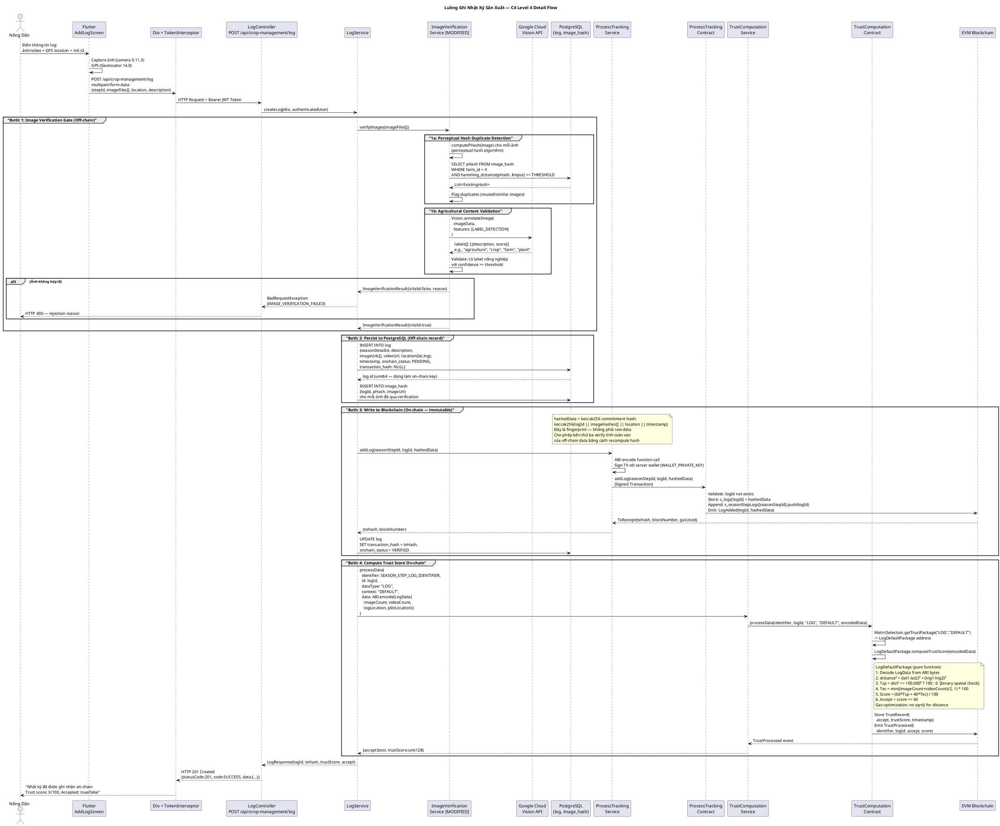
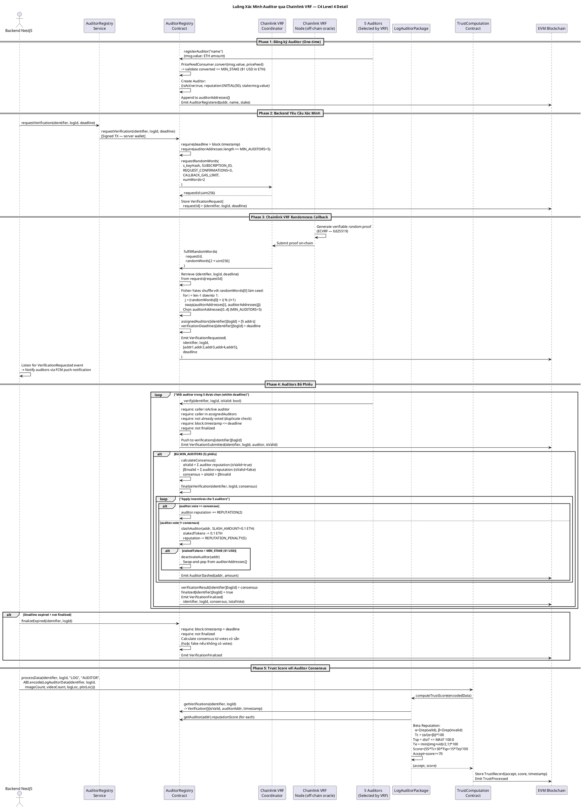
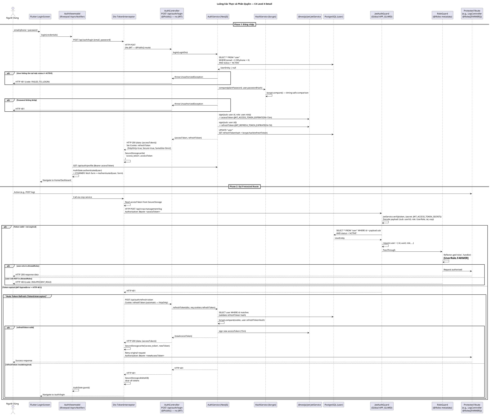
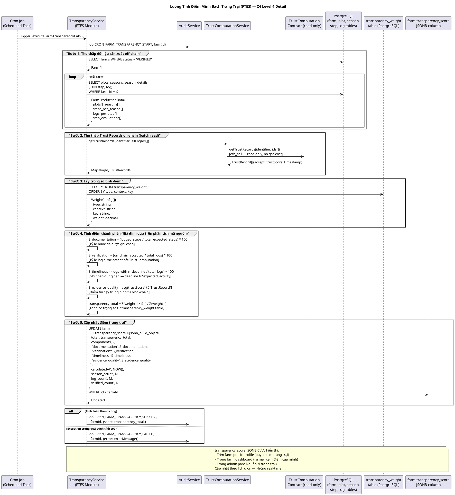

# 4.1 Tổng quan kiến trúc hệ thống

> Tài liệu này được tổng hợp từ phân tích tĩnh toàn bộ mã nguồn của hệ thống Farmera V2, bao gồm backend NestJS, ứng dụng di động Flutter, và hệ thống smart contract Solidity triển khai trên Foundry. Mọi nhận định kiến trúc đều dựa trực tiếp vào cấu trúc file, module dependency, entity definition, và contract source code.

---

## 4.1.1 Sơ đồ kiến trúc toàn hệ thống

### C4 Level 1 — System Context Diagram

#### Biểu đồ PlantUML

```plantuml
@startuml
!include https://raw.githubusercontent.com/plantuml-stdlib/C4-PlantUML/master/C4_Context.puml

LAYOUT_WITH_LEGEND()

title Farmera — C4 Level 1: System Context Diagram

Person(buyer, "Người Mua (Buyer)", "Khách hàng tìm kiếm và mua nông sản an toàn có nguồn gốc rõ ràng.")
Person(farmer, "Nông Dân (Farmer)", "Chủ trang trại quản lý quy trình sản xuất và bán sản phẩm.")

System(farmera, "Farmera V2", "Nền tảng truy xuất nguồn gốc nông sản, quản lý sản xuất và giao dịch, tích hợp blockchain và dịch vụ xác minh.")

System_Ext(zksync, "zkSync Network (Layer 2 on Ethereum)", "Lưu trữ nhật ký bất biến và tính điểm tin cậy.")
System_Ext(gcloud_vision, "Google Cloud Vision API", "Phân tích hình ảnh nông nghiệp.")
System_Ext(twilio, "Twilio / SendGrid", "Gửi OTP SMS và Email xác minh.")
System_Ext(file_storage, "R2 Storage", "Lưu trữ ảnh và video.")
System_Ext(ghn, "GHN Delivery", "Xử lý vận chuyển.")
System_Ext(fpt, "FPT API", "Xác thực CCCD và khuôn mặt.")

Rel(buyer, farmera, "Sử dụng hệ thống")
Rel(farmer, farmera, "Sử dụng hệ thống")

Rel(farmera, zksync, "Ghi nhật ký và đọc dữ liệu blockchain")
Rel(farmera, gcloud_vision, "Phân tích hình ảnh")
Rel(farmera, twilio, "Gửi OTP xác minh")
Rel(farmera, file_storage, "Lưu trữ tệp")
Rel(farmera, ghn, "Tạo đơn vận chuyển")
Rel(farmera, fpt, "Xác thực danh tính")

@enduml
```

#### Phân tích ngữ cảnh hệ thống

Hệ thống Farmera V2 là một nền tảng thương mại điện tử nông sản kết hợp công nghệ blockchain để đảm bảo tính minh bạch trong chuỗi sản xuất thực phẩm. Về mặt kiến trúc hệ thống, có bốn nhóm tác nhân chính và hai ranh giới tin cậy rõ ràng:

**Ranh giới On-chain (Trust Boundary 1 — Blockchain):**
Mọi dữ liệu được ghi lên smart contract đều là bất biến và công khai kiểm chứng được. Ba contract cốt lõi (`ProcessTracking`, `TrustComputation`, `AuditorRegistry`) tạo thành lớp không thể thay đổi sau khi đã ghi. Dữ liệu trên blockchain chỉ chứa *hash* của dữ liệu thực tế (không chứa raw data) để tối ưu chi phí gas, trong khi dữ liệu đầy đủ được lưu off-chain.

**Ranh giới Off-chain (Trust Boundary 2 — Controlled Infrastructure):**
Backend NestJS và cơ sở dữ liệu PostgreSQL hoạt động trong môi trường kiểm soát của nhà phát triển. Đây là điểm tập trung hóa có chủ ý: dữ liệu thương mại (đơn hàng, thanh toán, hồ sơ người dùng) không cần tính bất biến blockchain mà cần khả năng truy vấn linh hoạt và cập nhật nhanh.

**Quyết định kiến trúc — phân tách on-chain/off-chain:**
Backend chỉ ghi lên blockchain *hash* của bản ghi sản xuất, không phải toàn bộ payload. Cụ thể, `ProcessTracking.addLog(seasonStepId, logId, hashedData)` nhận `hashedData` là chuỗi hash cryptographic. Điều này cho phép bất kỳ bên thứ ba nào có thể kiểm chứng tính toàn vẹn của dữ liệu off-chain bằng cách so sánh với giá trị on-chain, mà không cần trả chi phí lưu trữ lớn trên blockchain.

**Rủi ro kiến trúc cần lưu ý:** Toàn bộ quyền ký giao dịch blockchain nằm trong biến môi trường `WALLET_PRIVATE_KEY` của server backend. Điều này tạo ra một single point of trust: nếu server bị xâm phạm, kẻ tấn công có thể ghi dữ liệu giả lên blockchain. Đây là đánh đổi thiết kế giữa UX (người dùng không cần ví crypto) và phi tập trung hóa hoàn toàn.

---

### C4 Level 2 — Container Diagram

#### Biểu đồ PlantUML


#### Phân tích container

**Container 1 — Flutter Mobile Application:**
Ứng dụng di động được xây dựng theo Clean Architecture với ba tầng tách biệt: tầng `presentation` (screens + viewmodels), tầng `data` (services, DTOs, repository implementations), và tầng `core` (models, repository interfaces, providers). State management sử dụng Riverpod với `AsyncNotifierProvider` pattern, cho phép quản lý trạng thái loading/error/data theo cách khai báo và type-safe. Toàn bộ model sử dụng `Freezed` để đảm bảo tính bất biến (immutability) và code generation cho JSON serialization.

Điểm đáng chú ý về ranh giới kiến trúc: **ứng dụng di động không có bất kỳ tích hợp Web3 hay ví crypto nào**. Mọi tương tác blockchain đều được proxy qua NestJS API server. Quyết định này đơn giản hóa UX đáng kể — người dùng cuối không cần hiểu về blockchain, gas fees, hay ký giao dịch — nhưng đánh đổi tính phi tập trung (người dùng phải tin tưởng server không ghi dữ liệu giả).

**Container 2 — NestJS API Server:**
Server được tổ chức theo NestJS modular architecture với hai nhóm module rõ ràng: `src/core/` (shared infrastructure: auth, redis, firebase, twilio, file-storage, audit) và `src/modules/` (feature domains: user, farm, product, order, crop-management, blockchain, ftes, qr, admin, review, address, notification). Global prefix `/api` được áp dụng cho tất cả routes. Response được chuẩn hóa qua `TransformInterceptor` bao bọc data trong `{ statusCode, code, message, data }`.

**Container 3 — PostgreSQL Database:**
Sử dụng TypeORM với UUID public ID và auto-increment internal ID. Các entity nhạy cảm có `@Exclude()`. Database triggers tự động cập nhật `updated_at` cho season và plot (từ migration `1769708443278-SetupTriggers`). Migration files thiết lập audit events, triggers, và seed data cho crop types, step templates, auditor profiles.

**Container 4 — Smart Contract Layer:**
Đây là thành phần then chốt tạo nên giá trị blockchain của hệ thống. Sáu contract được tổ chức thành ba nhóm chức năng:
- *Process Recording*: `ProcessTracking` — write-once log storage
- *Trust Computation*: `TrustComputation` + `MetricSelection` + `LogDefaultPackage` + `LogAuditorPackage` — pluggable scoring
- *Auditor Governance*: `AuditorRegistry` — stake, VRF-select, verify, reward/slash

**Container 5 — Object Storage:**
Factory pattern (`FileStorageModule`) hỗ trợ bốn provider: `LOCAL` (phát triển), `R2` (Cloudflare R2, production web), `AZURE` (Azure Blob Storage), `PINATA` (IPFS — cho dữ liệu cần tính vĩnh cửu phi tập trung). Provider được chọn qua biến môi trường `STORAGE_TYPE`. Interface `IFileStorage` đảm bảo tất cả service code không phụ thuộc vào implementation cụ thể.

---

### C4 Level 3 — Component Diagram

#### 4.1.1.3.1 — NestJS API Server Components

```plantuml
@startuml C4_Level3_NestJS_Components
!include https://raw.githubusercontent.com/plantuml-stdlib/C4-PlantUML/master/C4_Component.puml

LAYOUT_WITH_LEGEND()

title Farmera V2 — C4 Level 3: NestJS API Server Components

Container_Boundary(nestjs_api, "NestJS API Server") {

    Component_Boundary(cross_cutting, "Cross-Cutting Concerns (src/common/ + main.ts)") {
        Component(jwt_guard, "JwtAuthGuard", "NestJS Guard — Global APP_GUARD", "Xác thực JWT token trên mọi request.\nRoute không có @Public() đều bị kiểm tra.\nVerify signature + expiry + user status.")
        Component(role_guard, "RoleGuard", "NestJS Guard\n@Roles([UserRole.X])", "Kiểm tra quyền theo role:\nBUYER, FARMER, ADMIN, AUDITOR.\nĐọc metadata từ @Roles() decorator.")
        Component(transform_interceptor, "TransformInterceptor", "NestJS Interceptor — Global", "Bao bọc mọi response:\n{ statusCode, code, message, data }\nCode từ response-code.const.ts")
        Component(logging_interceptor, "LoggingInterceptor", "NestJS Interceptor — Global", "Log method, URL, body, query,\nparams cho mỗi HTTP request.")
        Component(exception_filter, "GlobalExceptionFilter", "NestJS ExceptionFilter — Global", "Bắt tất cả exception,\ntrả về response chuẩn hóa.")
        Component(helmet, "Helmet + Compression", "Express middleware", "Security headers (HSTS, X-Frame-Options).\nGzip response compression.")
    }

    Component_Boundary(core_layer, "Core Infrastructure (src/core/)") {
        Component(auth_module, "AuthModule", "NestJS Module — src/core/auth/", "JWT access token (15m) +\nRefresh token (httpOnly cookie, 7d).\nRegister, login, refresh,\npassword reset via Twilio OTP.")
        Component(audit_module, "AuditModule", "NestJS Module — src/core/audit/", "Ghi audit trail vào DB.\nAudit events: EKYC (IDR, LIVENESS, FACE_MATCH)\nFARM (CREATED, VERIFIED, APPROVED)\nCRON_TRANSPARENCY (FTS001-FTS004).")
        Component(redis_module, "RedisModule", "NestJS Module\n@nestjs/cache-manager", "Distributed caching layer.")
        Component(firebase_module, "FirebaseModule", "NestJS Module\nFirebase Admin SDK", "FCM push notifications.\nDevice token management.")
        Component(twilio_module, "TwilioModule", "NestJS Module\nTwilio + @sendgrid/mail", "SMS OTP (Twilio Verify).\nEmail (SendGrid).")
        Component(file_storage_module, "FileStorageModule", "NestJS Module — Factory Pattern\nIFileStorage interface", "4 implementations:\nLocalStorage, CloudflareR2,\nAzureBlob, PinataIPFS.\nSelected via STORAGE_TYPE env.")
    }

    Component_Boundary(user_domain, "User Domain (src/modules/user/)") {
        Component(user_module, "UserModule", "Controller + Service\nUser, PaymentMethod entities", "User CRUD, profile management.\nPayment method management.\nRelations: User→Farm, User→DeliveryAddress.")
    }

    Component_Boundary(farm_domain, "Farm Domain (src/modules/farm/)") {
        Component(farm_module, "FarmModule", "Controller + Service\nFarm, Identification, Certificate,\nApproval entities", "Farm registration + biometric KYC.\nCertificate upload + approval workflow.\ntransparency_score (JSONB) per farm.\nRelations: Farm→User, Farm→Products.")
    }

    Component_Boundary(product_domain, "Product Domain (src/modules/product/)") {
        Component(product_module, "ProductModule", "Controller + Service\nProduct, Category, SubCategory entities", "Product CRUD.\nProduct links to Farm và Season.\nCategory + Subcategory hierarchy.")
    }

    Component_Boundary(order_domain, "Order Domain (src/modules/order/)") {
        Component(order_module, "OrderModule", "Controller + Service\nOrder, OrderDetail, Payment,\nDelivery entities", "Tạo + theo dõi đơn hàng.\nPayment records.\nDelivery management.")
    }

    Component_Boundary(crop_domain, "Crop Management Domain (src/modules/crop-management/)") {
        Component(crop_svc, "Crop sub-module", "Controller + Service\ncrop.entity", "Loại cây trồng (SHORT_TERM/LONG_TERM).")
        Component(plot_svc, "Plot sub-module", "Controller + Service\nplot.entity", "Thửa đất: vị trí lat/lng (JSONB),\ndiện tích, transparency_score.")
        Component(season_svc, "Season sub-module", "Controller + Service\nseason.entity, season_detail.entity", "Vụ mùa: ngày, yield, status,\ntransparency_score. SeasonDetail\nlink Season với Step instances.")
        Component(step_svc, "Step sub-module", "Controller + Service\nstep.entity [MODIFIED]", "Bước sản xuất: type, status,\nevaluation (GOOD/ADEQUATE/POOR).\nSend on-chain qua ProcessTrackingService.")
        Component(log_svc, "Log sub-module", "Controller + Service\nlog.entity", "Nhật ký hoạt động hàng ngày.\nImages/videos, GPS location, timestamp.\ntransaction_hash (on-chain reference).\nonchain_status (PENDING/VERIFIED/REJECTED).")
        Component(img_verify, "ImageVerificationService", "[MODIFIED]\nGoogle Cloud Vision +\nPerceptual Hash", "1. pHash + Hamming distance:\n   Phát hiện ảnh trùng lặp/tương tự.\n2. Google Cloud Vision LABEL_DETECTION:\n   Xác minh nội dung nông nghiệp.\nGate keeper trước khi ghi on-chain.")
        Component(verification_svc, "Verification sub-module", "Controller + Service\nverification_assignment.entity", "Quản lý yêu cầu xác minh auditor.\nDeadline, vote_transaction_hash.")
        Component(auditor_profile_svc, "AuditorProfile sub-module", "Controller + Service\nauditor_profile.entity", "Hồ sơ kiểm định viên off-chain:\nwallet address, verification counts.")
    }

    Component_Boundary(blockchain_domain, "Blockchain Domain (src/modules/blockchain/)") {
        Component(process_tracking_svc, "ProcessTrackingService", "Service — Web3.js v4.16\nProcessTracking ABI", "addLog(seasonStepId, logId, hashedData)\naddStep(seasonId, seasonStepId, hashedData)\naddTempLog(logId, hashedData)\ngetLog(), getLogs(), getSteps()")
        Component(trust_computation_svc, "TrustComputationService", "Service — Web3.js v4.16\nTrustComputation ABI", "processData(identifier, id, dataType,\n  context, encodedData)\ngetTrustRecord(identifier, id)\ngetTrustRecords(identifier, ids[])")
        Component(auditor_registry_svc, "AuditorRegistryService", "Service — Web3.js v4.16\nAuditorRegistry ABI", "requestVerification()\nread verifications + auditor state.")
        Component(state_svc, "BlockchainStateService", "Service\nblockchain_sync_state.entity", "Theo dõi block number đã sync.\nState management cho event listeners.")
        Component(contract_abis, "Contract ABIs", "TypeScript + JSON\nProcessTracking.ts/.json\nTrustComputation.ts/.json\nAuditorRegistry.ts/.json", "ABI definitions để encode/decode\nblockhain calls. Generated từ\nFoundry compilation artifacts.")
    }

    Component_Boundary(ftes_domain, "FTES Domain (src/modules/ftes/)") {
        Component(transparency_svc, "TransparencyService", "Service — Cron-based\nfarm.transparency_score (JSONB)", "Tính toán điểm minh bạch tổng hợp\ncho trang trại. Kết hợp:\n- Off-chain: coverage, timeliness\n- On-chain: trust records từ TrustComputation\n- Weights: transparency_weight table")
        Component(calibration_svc, "CalibrationModule", "Module", "Hiệu chỉnh trọng số cho\ntừng loại hoạt động sản xuất.")
        Component(expected_activity_svc, "ExpectedActivityModule", "Module", "Định nghĩa hoạt động kỳ vọng\ncho từng loại cây trồng.")
        Component(score_history_svc, "ScoreHistoryModule", "Module", "Lịch sử điểm minh bạch theo thời gian.")
    }

    Component_Boundary(supporting, "Supporting Modules") {
        Component(notification_module, "NotificationModule", "Module\nnotification, device, log,\nreceiver, channel, template entities", "Multi-channel notifications:\nIn-app, FCM push, Email.\nTemplate-based messaging system.")
        Component(address_module, "AddressModule", "Module\ndelivery_address entity\nGHN integration", "Địa chỉ giao hàng Việt Nam.\nTích hợp GHN cho tỉnh/huyện/xã lookup.")
        Component(review_module, "ReviewModule", "Module\nreview, reply entities", "Đánh giá + phản hồi sản phẩm.")
        Component(qr_module, "QrModule", "Module\nqr.entity", "Tạo và quản lý QR codes\ncho sản phẩm và trang trại.")
        Component(admin_module, "AdminModule", "Module\n/api/admin/* routes", "Phê duyệt trang trại,\nquản lý người dùng hệ thống.")
        Component(hash_service, "HashService", "Shared Service\nsrc/services/hash.service.ts", "Bcrypt password hashing.\nbcrypt.hash() + bcrypt.compare().")
    }
}

ContainerDb(postgres, "PostgreSQL", "", "")
ContainerDb(redis_db, "Redis", "", "")
Container_Ext(blockchain_contracts, "Smart Contract Layer", "", "")
System_Ext(gcloud_ext, "Google Cloud Vision", "", "")
System_Ext(fcm_ext, "Firebase FCM", "", "")
System_Ext(twilio_ext, "Twilio/SendGrid", "", "")
System_Ext(storage_ext, "Object Storage", "", "")
System_Ext(ghn_ext, "GHN API", "", "")

Rel(jwt_guard, auth_module, "Verify JWT signature\n+ user status check", "")
Rel(role_guard, farm_module, "Enforce @Roles([FARMER])\non farm routes", "")
Rel(auth_module, hash_service, "Password hash + verify", "")
Rel(auth_module, twilio_module, "OTP SMS + email\nverification", "")
Rel(auth_module, redis_module, "Cache verification tokens", "")

Rel(farm_module, file_storage_module, "Upload farm images\n+ certificates", "")
Rel(farm_module, audit_module, "Log FARM_CREATED\nFARM_APPROVED events", "")

Rel(log_svc, img_verify, "Verify images\nbefore accepting log", "")
Rel(img_verify, gcloud_ext, "LABEL_DETECTION\nAPI call", "HTTPS")
Rel(log_svc, process_tracking_svc, "addLog() after\nimage verification passes", "")
Rel(step_svc, process_tracking_svc, "addStep() when\nstep confirmed", "")
Rel(log_svc, trust_computation_svc, "processData() to\ntrigger trust scoring", "")

Rel(process_tracking_svc, blockchain_contracts, "Web3 signed TX\nvia server wallet", "RPC")
Rel(trust_computation_svc, blockchain_contracts, "Web3 signed TX\nvia server wallet", "RPC")
Rel(auditor_registry_svc, blockchain_contracts, "Web3 read calls", "RPC")
Rel(process_tracking_svc, contract_abis, "ABI encode/decode", "")
Rel(trust_computation_svc, contract_abis, "ABI encode/decode", "")

Rel(transparency_svc, postgres, "Query farm/season\n/step/log data", "")
Rel(transparency_svc, trust_computation_svc, "getTrustRecords()\nfor on-chain scores", "")
Rel(transparency_svc, audit_svc, "Log CRON_FTS001-004\nevents", "")

Rel(notification_module, firebase_module, "FCM push via\nFirebase Admin SDK", "")
Rel(notification_module, twilio_module, "Email via SendGrid", "")
Rel(address_module, ghn_ext, "Province/district/ward lookup", "HTTPS")
Rel(file_storage_module, storage_ext, "Upload/download\nvia factory provider", "HTTPS")

Rel(user_module, postgres, "TypeORM CRUD", "")
Rel(farm_module, postgres, "TypeORM CRUD", "")
Rel(product_module, postgres, "TypeORM CRUD", "")
Rel(order_module, postgres, "TypeORM CRUD", "")
Rel(crop_domain, postgres, "TypeORM CRUD", "")
Rel(blockchain_domain, postgres, "tx_hash storage\nsync state", "")
Rel(redis_module, redis_db, "Cache read/write", "")
Rel(firebase_module, fcm_ext, "Send push notifications", "")
Rel(twilio_module, twilio_ext, "SMS + Email", "")

@enduml
```

#### Phân tích thành phần Backend

**Tầng Cross-Cutting Concerns — Secure by Default:**
`JwtAuthGuard` được đăng ký là `APP_GUARD` toàn cục trong `app.module.ts`, có nghĩa là *mọi* route đều được bảo vệ theo mặc định — developer phải chủ động dùng `@Public()` để bypass. Cách tiếp cận secure-by-default này giảm thiểu rủi ro quên bảo vệ route mới. `TransformInterceptor` đảm bảo tất cả response tuân theo schema chuẩn với `ResponseCode` enum, giúp Flutter client xử lý nhất quán mọi loại response.

**Tầng Core Infrastructure — Pluggable Services:**
`FileStorageModule` là ví dụ điển hình của Abstract Factory pattern trong NestJS. `IFileStorage` interface định nghĩa contract; bốn implementation (`LocalStorage`, `CloudflareR2`, `AzureBlob`, `PinataIPFS`) implement interface này. `STORAGE_TYPE` env var quyết định implementation nào được inject qua DI container. Điều này cho phép chuyển đổi storage provider mà không thay đổi bất kỳ service code nào — phù hợp với yêu cầu môi trường khác nhau (dev/staging/production).

**Tầng Crop Management — Anti-fraud Gate:**
`ImageVerificationService` (đang được sửa đổi theo git status) thực hiện hai lớp kiểm tra: (1) *perceptual hashing* (pHash + Hamming distance) để phát hiện ảnh trùng lặp hoặc ảnh đã dùng từ log khác — ngăn nông dân gian lận bằng cách reuse ảnh cũ; (2) *Google Cloud Vision API* label detection để xác minh ảnh có nội dung nông nghiệp thực tế. Chỉ sau khi qua cả hai kiểm tra, log mới được ghi lên blockchain qua `ProcessTrackingService`.

**Tầng Blockchain Domain — Oracle Bridge:**
`ProcessTrackingService` và `TrustComputationService` sử dụng `web3` v4.16.0 với server wallet (`WALLET_PRIVATE_KEY`) để ký giao dịch — đây là "oracle bridge" pattern, chuyển đổi từ authenticated HTTP request của user thành signed blockchain transaction từ server. ABIs được định nghĩa dưới dạng TypeScript types (`ProcessTracking.ts`, `TrustComputation.ts`) đảm bảo type-safety khi encode/decode contract calls. Transaction hash được lưu vào `log.transaction_hash` trong PostgreSQL để bất kỳ ai cũng có thể tự tra cứu on-chain.

**Tầng FTES Domain — Transparency Scoring Engine:**
`TransparencyService` tính điểm minh bạch tổng hợp qua cron job (không real-time). Điểm số (`farm.transparency_score` dạng JSONB) kết hợp dữ liệu off-chain (mức độ ghi chép, timeliness) với on-chain (trust records từ `TrustComputation` contract). Trọng số có thể được hiệu chỉnh qua `CalibrationModule` mà không cần deploy lại server — bằng cách cập nhật `transparency_weight` table trong PostgreSQL.

---

#### 4.1.1.3.2 — Flutter Mobile Application Components

```plantuml
@startuml C4_Level3_Flutter_Components
!include https://raw.githubusercontent.com/plantuml-stdlib/C4-PlantUML/master/C4_Component.puml

LAYOUT_WITH_LEGEND()

title Farmera V2 — C4 Level 3: Flutter Mobile Application Components

Container_Boundary(flutter_app, "Flutter Mobile Application") {

    Component_Boundary(core_layer, "Core Layer (lib/core/)") {
        Component(dio_stack, "Dio HTTP Client Stack", "Dio 5.8\nInterceptors:\n1. ApiInterceptor (Bearer token injection)\n2. TokenInterceptor (401 auto-refresh)\n3. LogInterceptor (request/response logging)", "HTTP client với interceptor chain.\nApiInterceptor: inject Authorization header\nvà Content-Type.\nTokenInterceptor: khi nhận 401, tự động\ngọi refresh-token rồi retry request gốc.")
        Component(token_storage, "SecureTokenStorage", "flutter_secure_storage 9.2\nOS-level AES encryption\n(Android Keystore / iOS Keychain)", "Lưu trữ mã hóa access token\nvà refresh token.\nKhông thể đọc từ ứng dụng khác.")
        Component(session_storage, "SessionStorage", "SharedPreferences", "Session data không nhạy cảm.")
        Component(auth_viewmodel, "AuthViewmodel", "Riverpod AsyncNotifier\nAuthState sealed:\nGuest | Authenticated{user, farm?}", "Global auth state.\nKhởi động: check token → fetch profile\n→ FARMER: fetch farm → Authenticated.\nLogout: clear all tokens → Guest.")
        Component(router, "GoRouter Configuration", "GoRouter 17.0\nAuthGuard + role-based redirects", "Toàn bộ route tree (40+ routes).\nAuthGuard: redirect /auth/login\nnếu chưa xác thực hoặc sai role.\nNamed routes cho type-safe navigation.")
        Component(repositories, "Repository Interfaces", "Abstract Dart classes\nData layer boundary", "Interface cho data access.\nImplementations inject qua Riverpod provider.\nDependency inversion principle.")
    }

    Component_Boundary(network_layer, "Network / Data Layer (lib/core/data/)") {
        Component(auth_service_f, "AuthService", "Dio service\nPOST /api/auth/login\nPOST /api/auth/register\nPOST /api/auth/refresh-token\nGET /api/auth/profile", "Authentication API calls.")
        Component(farm_service_f, "FarmService", "Dio service\nGET/POST/PATCH /api/farm/*", "Farm CRUD + certificate upload.")
        Component(crop_services_f, "CropServices\n(Plot/Season/Step/Log/Crop)", "Dio services\nGET/POST/PATCH\n/api/crop-management/*", "Toàn bộ crop management hierarchy\nqua REST API.")
        Component(product_service_f, "ProductService", "Dio service\nGET/POST /api/product/*", "Product listing, detail, filter.")
        Component(order_service_f, "OrderService", "Dio service\nPOST /api/order\nGET /api/order/my-orders\nGET /api/order/farmer/orders", "Order create + tracking.")
        Component(media_service_f, "MediaService", "Dio + Multipart\nPOST /api/file-storage/upload\nGET/PUT /api/file-storage/signed-url", "File upload với multipart.\nSigned URL pattern.")
    }

    Component_Boundary(features, "Feature Modules (lib/presentation/features/)") {
        Component(auth_feature_f, "Auth Feature", "Screens: Login, Register\nVerify Phone/Email\nForgot/Reset Password", "OTP verification flow (Twilio).\nPhone + Email verification.")
        Component(product_feature_f, "Product Feature (Buyer)", "Screens: Home, Detail\nSearch, SearchResult\nAsyncNotifierProviders", "Browse sản phẩm với phân trang.\nPaginatedResponse support.\nSeason traceability link.")
        Component(farm_feature_f, "Farm Feature", "Screens: FarmHome, Info,\nRegistration, Public, Certificate\nAsyncNotifierProviders", "Dashboard nông dân.\nKYC biometric (google_mlkit_face_detection).\nPublic farm profile cho buyers.")
        Component(crop_feature_f, "Crop Management Feature", "Screens: CropHome, PlotList\nPlotDetail, AddPlot\nSeasonList, SeasonDetail, AddSeason\nAddSeasonStep, AddLog\nMultiple AsyncNotifierProviders", "Giao diện đầy đủ cho:\nPlot → Season → Step → Log.\nCamera capture, GPS location.")
        Component(cart_checkout_f, "Cart & Checkout Feature", "Screens: Cart, Checkout\nPaymentMethodSelection, OrderCreated\nCartViewModel (StateNotifier)\nCheckoutViewmodel", "Cart: local state, groupBy farm,\nmulti-vendor checkout.\nPayment: COD (PayOS available but commented).")
        Component(order_feature_f, "Order & Farm Order Features", "Screens: Orders, OrderDetail\nFarmOrderList, FarmOrderDetail", "Buyer order history.\nFarmer order management.\nStatus tracking.")
        Component(profile_feature_f, "User & Address Features", "Screens: Profile, Account\nAddressList, AddressEdit", "Profile management.\nDelivery address CRUD.")
    }

    Component_Boundary(shared_widgets, "Shared Widgets (lib/presentation/widgets/)") {
        Component(qr_widget_f, "QR Code Widgets", "QRCodeDisplayWidget\nQRCodeGeneratorWidget\nQRCodeDialog\nQRCodeHelper\nqr_flutter 4.1\nmobile_scanner 7.0.1\nsaver_gallery 4.0", "Display + generate QR codes.\nShare + download to gallery.\nDeep link QR: farmera://product/:id\nTraceability QR với farm metadata.")
        Component(map_widget_f, "Map & Location Widgets", "flutter_map 8.2\ngoogle_maps_flutter 2.14\nGeolocator 14.0\nlatlong2 0.9", "Hiển thị vị trí trang trại/thửa đất.\nGPS capture cho production logs.")
        Component(camera_widget_f, "Camera Screen", "camera 0.11.3\nimage_picker 1.1.2\nmobile_scanner 7.0.1\nvideo_player 2.10", "Chụp ảnh/quay video cho log.\nQR code scanning.")
        Component(common_widgets_f, "Common Widgets", "Shimmer, Carousel, Badge\ncached_network_image\nLoading, EmptyState, Navigation", "Shared UI components.")
    }
}

Container_Ext(api, "NestJS API Server", "", "")

Rel(dio_stack, api, "HTTP requests + Bearer JWT", "HTTPS/JSON")
Rel(auth_viewmodel, token_storage, "Store/retrieve\naccess + refresh tokens", "")
Rel(auth_viewmodel, auth_service_f, "Login, refresh, profile", "")
Rel(router, auth_viewmodel, "Read AuthState\nfor route guards", "")
Rel(auth_feature_f, auth_viewmodel, "State transitions:\nlogin/logout/register", "")
Rel(product_feature_f, product_service_f, "Fetch paginated products", "")
Rel(farm_feature_f, farm_service_f, "Farm CRUD + KYC", "")
Rel(crop_feature_f, crop_services_f, "Plot/Season/Step/Log CRUD", "")
Rel(crop_feature_f, media_service_f, "Upload images/videos", "")
Rel(cart_checkout_f, order_service_f, "Create order on checkout", "")
Rel(crop_feature_f, camera_widget_f, "Capture ảnh/video", "")
Rel(crop_feature_f, map_widget_f, "GPS location capture", "")
Rel(product_feature_f, qr_widget_f, "Display product QR\nfor traceability", "")

@enduml
```

---

#### 4.1.1.3.3 — Smart Contract Layer Components

```plantuml
@startuml C4_Level3_SmartContracts
!include https://raw.githubusercontent.com/plantuml-stdlib/C4-PlantUML/master/C4_Component.puml

LAYOUT_WITH_LEGEND()

title Farmera V2 — C4 Level 3: Smart Contract Layer Components

Container_Boundary(contract_layer, "Smart Contract Layer — Solidity ^0.8.30 / Foundry") {

    Component_Boundary(process_group, "Process Tracking Group") {
        Component(process_tracking_c, "ProcessTracking", "src/process-tracking/ProcessTracking.sol\nNo access control\nWrite-once, append-only", "Lưu trữ bất biến nhật ký sản xuất.\nData hierarchy: Season → SeasonStep → Log\nmapping(logId => string hashedData)\nmapping(seasonStepId => uint64[] logIds)\nmapping(seasonId => uint64[] seasonStepIds)\nRevert: 'Log already exists', 'Step already exists'\nEvents: LogAdded, TempLogAdded, StepAdded")
    }

    Component_Boundary(trust_group, "Trust Computation Group") {
        Component(trust_computation_c, "TrustComputation", "src/trustworthiness/TrustComputation.sol\nOrchestrator — Write-once trust records", "Điều phối tính toán điểm tin cậy.\nmapping(bytes32 × uint64) → TrustRecord{accept, trustScore, timestamp}\nprocessData(): lookup package → delegate → store immutably.\nDuplicate prevention: revert nếu đã xử lý.\nEvent: TrustProcessed(identifier, id, accept, score)")

        Component(metric_selection_c, "MetricSelection", "src/trustworthiness/MetricSelection.sol\nRegistry pattern", "Registry cho trust packages.\nmapping(keccak256(dataType+context) => address)\nregisterTrustPackage(): no duplicates allowed.\ngetTrustPackage(): returns address(0) if not found.\nEvent: TrustPackageRegistered(key)")

        Component(trust_pkg_interface, "ITrustPackage", "src/trustworthiness/interfaces/TrustPackage.sol\nSolidity Interface", "Standard interface:\ncomputeTrustScore(bytes calldata payload)\n  -> (bool accept, uint128 score)\nPure function: no state read/write.\nABI-encoded payload input.")

        Component(log_default_c, "LogDefaultPackage", "src/trustworthiness/packages/LogDefaultPackage.sol\nPure computation — No external calls", "Thuật toán mặc định (không cần auditor).\nInput: LogData{imageCount, videoCount,\n  logLocation{lat,lng}, plotLocation{lat,lng}}\nWeights: Tsp=60%, Tec=40%, Accept>=60\nTsp: dist² <= MAX_DISTANCE(100,000)² ? 100:0\nTec: min((img+vid)/2, 1)*100\nScore = (60*Tsp + 40*Tec)/100")

        Component(log_auditor_c, "LogAuditorPackage", "src/trustworthiness/packages/LogAuditorPackage.sol\nCalls AuditorRegistry (cross-contract)", "Thuật toán với đồng thuận auditor.\nInput: LogAuditorData{identifier, id,\n  imageCount, videoCount, locations}\nWeights: Tc=55%, Tsp=30%, Te=15%, Accept>=70\nTc = Beta Reputation (Jøsang & Ismail 2002):\n  α=Σrep(isValid=true)\n  β=Σrep(isValid=false)\n  Tc = α/(α+β)*100")
    }

    Component_Boundary(auditor_group, "Auditor Governance Group") {
        Component(auditor_registry_c, "AuditorRegistry", "src/auditor/AuditorRegistry.sol\nVRFConsumerBaseV2Plus\nChainlink VRF 2.5\nChainlink Price Feed", "Quản lý vòng đời kiểm định viên:\nregisterAuditor(): stake ETH, validate >= $1 USD\nrequestVerification(): VRF 2 random words\nfulfillRandomWords(): Fisher-Yates shuffle,\n  chọn MIN_AUDITORS(5) ngẫu nhiên\nverify(identifier, id, isValid): bỏ phiếu\nfinalizeVerification(): weighted consensus\n  reward: +REPUTATION(2)\n  slash: -REPUTATION_PENALTY(5), -SLASH_AMOUNT(0.1 ETH)\n  deactivate nếu stake < $1 USD\nSwap-and-pop pattern cho deactivation O(1)")

        Component(price_feed_lib, "PriceFeedConsumer", "src/auditor/PriceFeedConsumer.sol\nSolidity Library", "getLatestPrice(AggregatorV3Interface)\n  -> int256 price from latestRoundData()\nconvert(uint256 amount, feed)\n  -> normalize to 18 decimals\nValidate: msg.value >= $1 USD equivalent")
    }
}

System_Ext(chainlink_vrf_ext, "Chainlink VRF 2.5\nVRFCoordinatorV2Plus", "")
System_Ext(chainlink_price_ext, "Chainlink Price Feed\nAggregatorV3Interface\n(ETH/USD)", "")
Container_Ext(backend, "NestJS API Server", "", "")

Rel(backend, process_tracking_c, "addLog(seasonStepId, logId, hashedData)\naddStep(seasonId, seasonStepId, hashedData)\naddTempLog(logId, hashedData)\ngetLog(), getLogs(), getStep(), getSteps()", "Web3 RPC / Signed TX")
Rel(backend, trust_computation_c, "processData(identifier, id, dataType, context, data)\ngetTrustRecord(identifier, id)\ngetTrustRecords(identifier, ids[])", "Web3 RPC / Signed TX")
Rel(backend, auditor_registry_c, "requestVerification(identifier, id, deadline)\nread verifications state", "Web3 RPC")

Rel(trust_computation_c, metric_selection_c, "getTrustPackage(dataType, context)\n-> package address", "EVM Internal Call")
Rel(trust_computation_c, log_default_c, "computeTrustScore(encodedLogData)\n-> (accept, score)", "EVM Internal Call\n(via ITrustPackage)")
Rel(trust_computation_c, log_auditor_c, "computeTrustScore(encodedLogAuditorData)\n-> (accept, score)", "EVM Internal Call\n(via ITrustPackage)")
Rel(log_default_c, trust_pkg_interface, "implements interface", "")
Rel(log_auditor_c, trust_pkg_interface, "implements interface", "")
Rel(log_auditor_c, auditor_registry_c, "getVerifications(identifier, id)\ngetAuditor(addr).reputationScore", "EVM Cross-contract Read")

Rel(auditor_registry_c, chainlink_vrf_ext, "requestRandomWords(keyHash, subId,\n  confirmations=3, numWords=2, gasLimit)\nreceives: fulfillRandomWords() callback", "Chainlink VRF Protocol")
Rel(auditor_registry_c, price_feed_lib, "convert(msg.value, priceFeed)\n-> validate >= $1 USD", "Library Call")
Rel(price_feed_lib, chainlink_price_ext, "latestRoundData()\n-> int256 price, uint8 decimals", "AggregatorV3Interface")

@enduml
```

---

### C4 Level 4 — Critical Data Flow Diagrams

#### 4.1.1.4.1 — Luồng ghi nhật ký sản xuất (Crop Log Submission)

Đây là luồng nghiệp vụ trung tâm của hệ thống, kết hợp xác minh off-chain (AI + perceptual hash) với ghi nhật ký on-chain bất biến.



---

#### 4.1.1.4.2 — Luồng xác minh Auditor với Chainlink VRF



---

#### 4.1.1.4.3 — Luồng xác thực và phân quyền (Auth & Authorization)



---

#### 4.1.1.4.4 — Luồng tính điểm minh bạch trang trại (FTES Transparency Score)



---

## 4.1.2 Phân tích kiến trúc tổng thể

### 4.1.2.1 Mô hình kiến trúc và các pattern được xác định

Hệ thống Farmera V2 tuân theo mô hình **Hybrid Blockchain Architecture** — kết hợp modular monolith backend (NestJS) với decentralized smart contract layer. Đây không phải microservice thuần túy (không có service mesh, không có API gateway phân tán) nhưng cũng không phải monolith hoàn toàn vì smart contracts hoạt động hoàn toàn độc lập trên EVM.

**Bảng tổng hợp các Architectural Pattern:**

| Pattern | Vị trí áp dụng | Mục đích | Trade-off |
|---------|----------------|---------|-----------|
| Modular Monolith | NestJS backend | Domain separation với shared PostgreSQL | Đơn giản hóa deployment, nhưng khó scale riêng từng domain |
| Clean Architecture (MVVM) | Flutter app | Tách biệt presentation, domain, data | Nhiều boilerplate hơn, nhưng testable và maintainable |
| Abstract Factory | FileStorageModule | Multi-provider storage abstraction | Thêm abstraction layer, nhưng cho phép swap provider |
| Repository Pattern | Flutter data layer | Abstract data access | Thêm interface layer, nhưng dễ mock trong tests |
| Oracle Bridge | BlockchainModule | HTTP auth → blockchain TX | Centralized signing, nhưng UX tốt hơn |
| Strategy/Pluggable Algorithm | MetricSelection + ITrustPackage | Extensible trust algorithms | Cần deploy contract mới cho mỗi algorithm mới |
| Write-Once / Append-Only | ProcessTracking, TrustComputation | Immutability guarantee | Không thể sửa lỗi sau khi ghi, tốn gas |
| Beta Reputation System | AuditorRegistry | Weighted consensus với penalty | Complexity cao, nhưng chống collusion |
| Interceptor Chain | Dio (Flutter) + NestJS | Cross-cutting concerns | Debugging khó hơn khi nhiều interceptors |
| Secure-by-Default | JwtAuthGuard (APP_GUARD) | All routes protected unless @Public() | Phải nhớ đánh dấu public routes |

### 4.1.2.2 Ranh giới Domain (Domain Boundaries)

Backend NestJS phân chia thành bốn domain chính với ranh giới được thể hiện qua NestJS module system:

```
┌───────────────────────────────────────────────────────────────┐
│                    Core Infrastructure                         │
│  AuthModule · AuditModule · RedisModule · FirebaseModule      │
│  TwilioModule · FileStorageModule                             │
└───────────────────────────────────────────────────────────────┘
         │              │              │              │
┌────────────┐  ┌──────────────┐  ┌──────────┐  ┌──────────────┐
│ Identity & │  │ Supply Chain │  │ Commerce │  │ Governance   │
│ Farm Domain│  │ Domain       │  │ Domain   │  │ Domain       │
│            │  │              │  │          │  │              │
│ UserModule │  │ CropMgmt     │  │ Product  │  │ AdminModule  │
│ FarmModule │  │ Blockchain   │  │ Order    │  │ AuditModule  │
│ AuthModule │  │ FTESModule   │  │ Review   │  │ Notification │
│            │  │ QrModule     │  │ Address  │  │              │
└────────────┘  └──────────────┘  └──────────┘  └──────────────┘
```

**Supply Chain Domain** là domain phức tạp nhất và là core value proposition:
- `CropManagementModule`: lifecycle sản xuất off-chain
- `BlockchainModule`: gateway duy nhất tới on-chain (single responsibility)
- `FTESModule`: scoring engine tổng hợp on-chain + off-chain data
- `QrModule`: traceability endpoint cho consumer

### 4.1.2.3 Ranh giới On-chain / Off-chain và Data Ownership

```
OFF-CHAIN (PostgreSQL — Controlled)          ON-CHAIN (EVM — Public, Immutable)
────────────────────────────────────────     ──────────────────────────────────
User profiles, passwords, JWT tokens         —
Farm registration details, metadata         —
Product listings, prices, stock              —
Order data, payment records                  —
Full images/videos (Object Storage)          —
Detailed log metadata, descriptions         Hash commitment of log (hashedData)
Step notes, step evaluation scores          Hash commitment of step
Season yield data                            —
Auditor off-chain profiles                   Auditor stake, reputation, wallet
Verification assignment data                 Verification votes (immutable)
                                             Trust records (accept, score)
                                             MetricSelection package registry
                                             VRF random proofs
```

**Quy tắc phân tách dữ liệu (Data Ownership Principle):**
Dữ liệu được ghi on-chain khi thỏa mãn: (1) cần tính bất biến — không ai (kể cả admin) có thể xóa/sửa; (2) cần tính công khai kiểm chứng — bên thứ ba độc lập có thể verify; (3) không yêu cầu query phức tạp hoặc tốc độ cao. Ngược lại, dữ liệu thương mại, profile, media được lưu off-chain vì cần flexibility, query performance, và khả năng cập nhật.

**Commitment Hash Pattern:** Backend không lưu raw data lên blockchain mà lưu `keccak256(content)`. Bất kỳ bên thứ ba nào có off-chain data gốc đều có thể verify: `keccak256(offchainData) == onchainHash`. Đây là cơ chế đảm bảo *data integrity* mà không cần lưu toàn bộ data on-chain.

### 4.1.2.4 Cơ chế bảo mật đa lớp

**Lớp 1 — Transport Security:**
HTTPS enforced toàn bộ, Helmet middleware (X-Frame-Options, HSTS, CSP, X-Content-Type-Options), httpOnly + Secure + SameSite=Strict cho refresh token cookie (chống CSRF và XSS).

**Lớp 2 — Authentication (Dual-Token Scheme):**
Short-lived access token (15 phút, JWT Bearer) kết hợp với long-lived refresh token (7 ngày, httpOnly cookie). Refresh token được bcrypt-hash trước khi lưu DB — nếu database bị dump, token hash không thể dùng để lấy access token mới. Flutter `TokenInterceptor` tự động refresh trên 401 và retry request gốc — UX transparent.

**Lớp 3 — Authorization (Secure-by-Default RBAC):**
Bốn role: `BUYER`, `FARMER`, `ADMIN`, `AUDITOR`. JWT payload chứa `role` — server không cần query DB mỗi request. Secure-by-default: mọi route protected trừ khi `@Public()`. `JwtAuthGuard` chạy trước `RoleGuard` — authentication trước, authorization sau.

**Lớp 4 — Anti-fraud (Image Verification Gate):**
`ImageVerificationService` là cổng kiểm soát bắt buộc trước khi log được ghi on-chain. Hai kiểm tra song song: perceptual hash (chống reuse ảnh cũ) và Google Cloud Vision (chống upload ảnh không liên quan). Chỉ khi cả hai pass, log mới được commit lên blockchain.

**Lớp 5 — Economic Security (Staking + Slashing):**
Auditor phải stake ETH tương đương $1 USD (via Chainlink Price Feed) để đăng ký. Vote sai consensus bị phạt -5 reputation và -0.1 ETH. Dưới ngưỡng $1 USD stake thì bị deactivate. Cơ chế này tạo incentive kinh tế chống collusion và careless voting.

**Lớp 6 — Random Auditor Selection (Chainlink VRF):**
Sử dụng VRF 2.5 (Verifiable Random Function) để chọn ngẫu nhiên 5 auditor trong số tất cả auditor active. Randomness này có thể kiểm chứng on-chain — không ai (kể cả contract deployer) có thể dự đoán hay thao túng việc chọn auditor.

### 4.1.2.5 Chiến lược xử lý lỗi (Error Handling Strategy)

**Backend NestJS:**
`GlobalExceptionFilter` bắt tất cả exception ở mức global và chuẩn hóa về format `{ statusCode, code, message }`. Domain-specific error codes định nghĩa trong `response-code.const.ts` cho phép Flutter client xử lý lỗi theo business logic (không phải HTTP status code). TypeORM query errors được wrap thành HTTP-friendly exceptions.

**Flutter App:**
`AsyncNotifier` pattern của Riverpod tự động quản lý `AsyncValue<T>` với ba trạng thái: `loading`, `data`, `error`. `TokenInterceptor` xử lý `401` với automatic retry sau khi refresh — lỗi này transparent với user. Response format chuẩn hóa từ `TransformInterceptor` được parse nhất quán trong mọi service.

**Smart Contracts:**
`require()` với descriptive error messages cho mọi invalid operation. Write-once check: `revert("Log already exists")`, `revert("Step already exists")`. Auditor validation: nhiều `require` statements trước mọi state mutation. `revert` tự động hoàn trả toàn bộ state change nếu bất kỳ điều kiện nào fail.

**Rủi ro chưa xử lý:** Blockchain transaction failures (network timeout, gas estimation errors, nonce conflicts) không có built-in retry mechanism trong `ProcessTrackingService` và `TrustComputationService`. Đây là rủi ro kiến trúc cần giải quyết qua message queue (BullMQ/Bull) cho async blockchain TX.

### 4.1.2.6 Quan sát và Giám sát (Observability)

**Hiện có:**
- `LoggingInterceptor`: Structured request logging (method, URL, body, query, params, duration)
- `AuditService`: Business event audit trail trong PostgreSQL với event IDs (`EKYC_IDR`, `EKYC_LIVENESS`, `EKYC_FACE_MATCH`, `FARM_CREATED`, `FARM_VERIFIED`, `FARM_APPROVED`, `CRON_FARM_TRANSPARENCY_START/SUCCESS/FAILED`)
- Migration-based audit event seeding (1767351935206-AuditSetup.ts, 1770276217573-AuditTransparencyActionsSetup.ts)

**Hạn chế hiện tại (Giả định dựa trên phân tích mã nguồn):**
Không có distributed tracing (OpenTelemetry/Jaeger/Zipkin); không có metrics endpoint (Prometheus); không có structured logging với correlation IDs để trace request qua multiple services; blockchain event monitoring (listening to contract events) chưa được implement đầy đủ trong `BlockchainStateService`.

### 4.1.2.7 Phân tích rủi ro kiến trúc

| # | Rủi ro | Mức độ | Mô tả chi tiết | Giảm thiểu đề xuất |
|---|--------|--------|----------------|-------------------|
| R1 | Single server wallet key | **Cao** | `WALLET_PRIVATE_KEY` env var là single point of failure. Server bị compromise → kẻ tấn công ký giao dịch giả. | Multi-sig wallet (Gnosis Safe) hoặc HSM (Hardware Security Module) |
| R2 | Không có blockchain TX retry | **Trung bình** | Network timeout hoặc gas spike có thể làm TX fail. Không có cơ chế retry → log/step không được ghi on-chain. | Message queue (BullMQ) với idempotent TX submission |
| R3 | Centralized oracle bridge | **Trung bình** | Server quyết định hash nào được ghi on-chain. Server có thể bỏ qua log hoặc ghi hash sai mà user không biết. | Merkle proof verification cho users; event log public exposure |
| R4 | No rate limiting trên contracts | **Thấp** | ProcessTracking không có access control — ai cũng có thể gọi addLog nếu biết contract address. | Backend validation đủ cho MVP; thêm Ownable cho production |
| R5 | VRF subscription balance | **Trung bình** | AuditorRegistry.requestVerification() revert nếu VRF subscription hết LINK. | Monitor subscription balance + alert system |
| R6 | Google Cloud Vision cost | **Thấp** | Mỗi ảnh upload tốn một API call. Với volume lớn, chi phí tăng đáng kể. | Rate limiting + quota management + cache kết quả |
| R7 | Perceptual hash false positive | **Thấp** | Hai ảnh khác nhau có thể có Hamming distance dưới threshold. Chặn nhầm ảnh hợp lệ. | Threshold tuning + manual review queue cho false positive cases |
| R8 | No distributed tracing | **Thấp** | Request trải qua nhiều services (NestJS → blockchain → Vision API) không có correlation ID. | OpenTelemetry integration |

---

## 4.1.3 Tóm tắt kiến trúc

Hệ thống Farmera V2 thể hiện một kiến trúc **Pragmatic Blockchain Integration** — không cố gắng phi tập trung hóa toàn bộ hệ thống, mà chọn lọc chỉ đưa lên blockchain những dữ liệu thực sự cần tính bất biến và công khai kiểm chứng. Backend NestJS đóng vai trò "oracle bridge" tin cậy giữa người dùng (không cần ví crypto) và blockchain (cung cấp bảo đảm cryptographic). Flutter frontend triển khai Clean Architecture hoàn chỉnh với Riverpod state management, độc lập hoàn toàn với blockchain layer.

Điểm mạnh kiến trúc nổi bật nhất là **Trust Computation pluggable system**: `MetricSelection` registry + `ITrustPackage` interface cho phép thêm/thay đổi thuật toán tính điểm tin cậy mà không cần redeploy core contracts. Kết hợp với Chainlink VRF cho unbiased random auditor selection, Beta Reputation System (Jøsang & Ismail 2002) cho weighted consensus, và economic staking/slashing mechanism, hệ thống xây dựng được cơ chế chống gian lận đa lớp với incentive kinh tế rõ ràng.

Điểm cần cải thiện chính là: single server wallet key (R1), thiếu async TX queue (R2), và thiếu distributed tracing (R8) — tất cả đều là vấn đề infrastructure cần giải quyết trước khi chuyển sang production với volume cao.

---

*Tài liệu được tạo ngày 2026-02-24 dựa trên phân tích tĩnh toàn bộ mã nguồn hệ thống Farmera V2. Backend: NestJS 11, TypeScript 5.9, TypeORM 11, web3 v4.16. Frontend: Flutter 3.8, Riverpod 3.0, Freezed 3.0, GoRouter 17.0. Smart Contracts: Solidity ^0.8.30, Foundry, Chainlink VRF 2.5 + Price Feed. Các nhận định đánh dấu "Giả định dựa trên phân tích mã nguồn" chỉ ra nơi implementation chi tiết không được xác nhận trực tiếp từ source code.*
