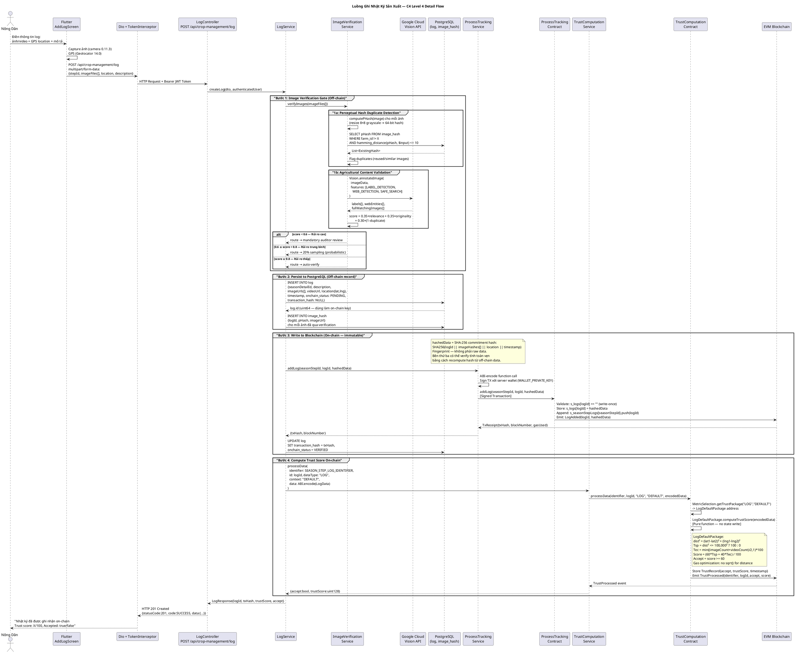
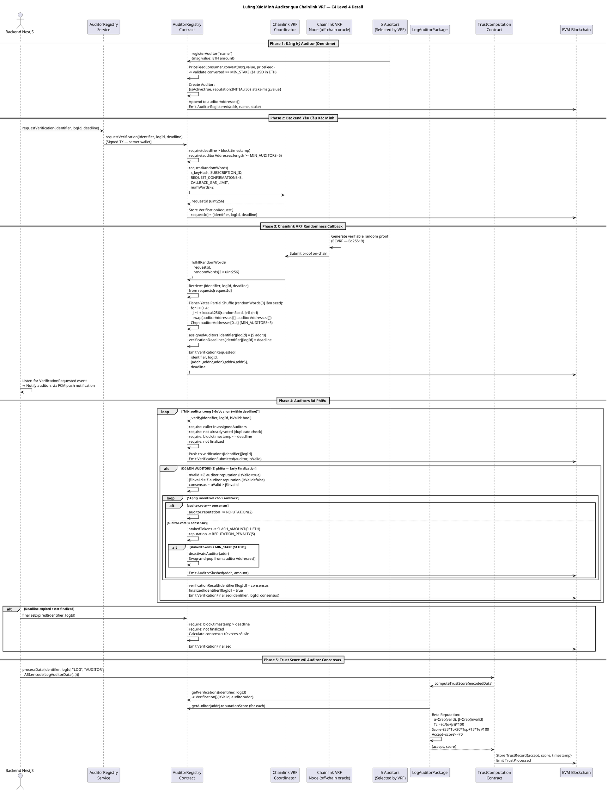
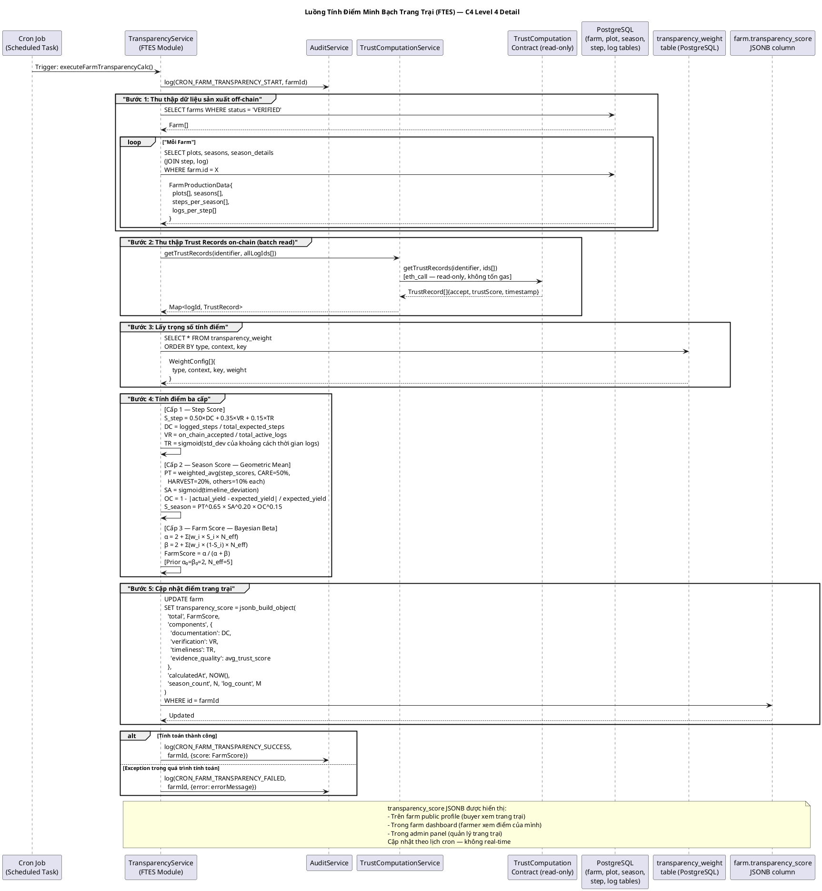

## 4.2 Thiết kế cơ sở dữ liệu

### 4.2.1 Nguyên tắc thiết kế

Cơ sở dữ liệu Farmera V2 được thiết kế xoay quanh một yêu cầu đặc thù: **dữ liệu nông nghiệp phải vừa linh hoạt vừa không thể chối cãi**. Không giống các hệ thống thương mại điện tử thông thường, mỗi nhật ký canh tác trong Farmera mang tính bằng chứng pháp lý — nó được neo cột mốc bất biến trên blockchain, nghĩa là thiết kế database phải đảm bảo tính toàn vẹn dữ liệu ở cả cấp ứng dụng lẫn cấp hạ tầng.

Ba nguyên tắc chính định hướng toàn bộ thiết kế. Nguyên tắc đầu tiên là **phân tách định danh công khai và khóa nội bộ**: mỗi thực thể có hai định danh — UUID công khai (exposed qua API) và auto-increment integer (dùng cho JOIN và foreign key nội bộ). UUID ngăn enumeration attack (kẻ tấn công không thể đoán ID tuần tự), trong khi integer đảm bảo hiệu năng query với B-tree index. Nguyên tắc thứ hai là **JSONB cho dữ liệu cấu trúc linh hoạt**: hai trường quan trọng nhất của hệ thống — `location` (tọa độ GPS của mảnh đất và nhật ký) và `transparency_score` (điểm FTES dạng cấu trúc đa chiều) — được lưu dạng JSONB thay vì các cột riêng. Điều này cho phép schema của điểm minh bạch thay đổi qua các phiên bản FTES mà không cần migration. Nguyên tắc thứ ba là **audit trail bất bypass bằng database trigger**: các trigger PostgreSQL ghi lại mọi thay đổi trên bảng nhạy cảm (farm, log, season) vào bảng `audit` ngay tầng database — không thể bị bỏ qua dù code ứng dụng hay truy cập trực tiếp database.

> 📸 **[Ảnh kiến trúc: Sơ đồ ERD tổng thể — toàn bộ bảng và quan hệ foreign key]**

### 4.2.2 Nhóm bảng quản lý canh tác — Xương sống của hệ thống

Hệ thống phân cấp canh tác được mô hình hóa qua năm bảng chính theo chuỗi: `crop` → `plot` → `season` → `season_detail` → `log`. Chuỗi này ánh xạ trực tiếp vào quy trình canh tác thực tế: mỗi loại cây trồng (`crop`) có bộ quy trình mẫu VietGAP; nông dân canh tác trên mảnh đất cụ thể (`plot`) theo từng mùa vụ (`season`); mỗi mùa vụ thực hiện lần lượt các bước quy trình (`season_detail` là thực thể JOIN giữa `season` và `step`); và mỗi bước được ghi chép bằng các nhật ký bằng chứng (`log`).

Bảng `step` là nơi chứa template VietGAP. Mỗi step có trường `order` là số nguyên (10, 20, 30...) xác định thứ tự thực hiện, kết hợp với kiểu `type` (PREPARE, PLANTING, CARE, HARVEST, POST_HARVEST) tương ứng với năm giai đoạn tiêu chuẩn VietGAP. Thiết kế `order` theo nhóm thập phân cho phép insert step phụ (10, 11, 12 là sub-steps của giai đoạn 10) mà không vi phạm thứ tự — hệ thống kiểm tra `Math.floor(order/10)` để xác định "nhóm giai đoạn" thay vì kiểm tra giá trị tuyệt đối.

Bảng `season_detail` là thực thể trung tâm của toàn bộ trạng thái sản xuất. Nó lưu `step_status` (PENDING/IN_PROGRESS/DONE) để kiểm soát tiến trình, `transaction_hash` là bằng chứng on-chain khi bước được xác minh, và `transparency_score` là điểm tin cậy của bước tính bởi FTES engine. Trường `inactive_logs` đếm số nhật ký bị từ chối hoặc bỏ qua — dùng cho công thức tính điểm Verification Rate.

Bảng `log` là đơn vị bằng chứng cơ bản nhất. Mỗi nhật ký chứa mảng `image_urls[]` và `video_urls[]` (PostgreSQL array type), `location` JSONB {lat, lng} cho xác minh GPS, và `status` (Pending/Verified/Rejected/Skipped) phản ánh kết quả xác minh. Trường `transaction_hash` liên kết nhật ký với giao dịch blockchain tương ứng — đây là cầu nối quan trọng giữa dữ liệu off-chain và bằng chứng on-chain.

### 4.2.3 Nhóm bảng xác minh

Nhóm bảng xác minh hỗ trợ pipeline kiểm tra ảnh hai lớp. Bảng `image_hash` lưu perceptual hash 64-bit (kiểu `bit(64)` của PostgreSQL) cho mỗi ảnh đã upload, kèm `farm_id` để phục vụ truy vấn cross-farm duplicate detection. Câu truy vấn dùng hàm `bit_count()` để tính Hamming distance trực tiếp trong SQL — tận dụng khả năng tính toán bitwise của PostgreSQL mà không cần load dữ liệu lên ứng dụng.

Bảng `log_image_verification_result` lưu kết quả tổng hợp của cả hai lớp xác minh: `overall_score` (0–1), `is_duplicate`, `relevance_score`, `manipulation_score`, và `ai_analysis` dạng JSONB chứa toàn bộ kết quả chi tiết từ Google Vision API. Bảng này phục vụ hai mục đích: làm cơ sở định tuyến (route log đến auditor hay tự động duyệt), và là tài liệu minh chứng hiển thị cho kiểm định viên khi họ nhận nhiệm vụ.

Bảng `verification_assignment` ghi lại việc phân công kiểm định viên: `auditor_profile_id`, `log_id`, `deadline`, và `vote_transaction_hash` (hash của giao dịch blockchain khi auditor submit phiếu). Đây là bảng bridge giữa sự kiện on-chain (VerificationRequested) và thực thể người dùng off-chain — cron job polling blockchain sẽ tạo các record này khi nhận được event từ `AuditorRegistry`.

### 4.2.4 Các nhóm bảng còn lại

Nhóm bảng Identity lưu thông tin người dùng và trang trại. Bảng `user` có `role` enum (BUYER/FARMER/ADMIN/AUDITOR) và hai trường hash quan trọng: `password_hash` (bcrypt) và `refresh_token_hash` — lưu hash của refresh token thay vì token gốc để nếu database bị lộ, token cũng không thể dùng được. Bảng `farm` có `transparency_score` JSONB — lưu điểm FTES theo cấu trúc `{overall, breakdown: {documentation, verification, timeliness}, confidence, lastUpdated}`.

Nhóm bảng Commerce có `product` liên kết với cả `farm_id` lẫn `season_id` — đây là mắt xích truy xuất nguồn gốc: từ một sản phẩm có thể trace ngược về mùa vụ, từ mùa vụ trace về từng bước quy trình và nhật ký bằng chứng. Nhóm bảng System có `transparency_weight` — bảng cấu hình runtime cho phép điều chỉnh trọng số FTES qua API admin mà không cần redeploy, và `blockchain_sync_state` lưu block number đã xử lý để cron job event listener không xử lý lại event cũ.

> 📸 **[Ảnh kiến trúc: Sơ đồ ERD chi tiết nhóm Supply Chain — crop, plot, season, season_detail, log và các quan hệ]**

---

## 4.3 Chi tiết thiết kế hệ thống

Phần này trình bày thiết kế chi tiết của sáu thành phần cốt lõi tạo nên giá trị cốt lõi của Farmera V2. Với mỗi thành phần, phần kiến trúc tổng thể được trình bày trước qua các biểu đồ C4 Level 3 (Component) và C4 Level 4 (Dynamic/Sequence) được rút ra từ phân tích mã nguồn thực tế, sau đó đi sâu vào từng cơ chế thiết kế và quyết định kỹ thuật quan trọng.

---

### 4.3.1 Quản lý quy trình canh tác theo tiêu chuẩn VietGAP

#### Sơ đồ kiến trúc thành phần

Miền Crop Management trong NestJS được tổ chức thành tám sub-module phân cấp rõ ràng, mỗi sub-module chịu trách nhiệm một tầng trong hệ thống phân cấp canh tác. `ImageVerificationService` đóng vai trò cổng chắn (gatekeeper) — mọi nhật ký phải qua xác minh ảnh trước khi được ghi lên blockchain.

```plantuml
@startuml C4_CropManagement_Domain
!include https://raw.githubusercontent.com/plantuml-stdlib/C4-PlantUML/master/C4_Component.puml

LAYOUT_WITH_LEGEND()

title Farmera V2 — Crop Management Domain (C4 Level 3 Component View)

Container_Boundary(crop_domain, "Crop Management Domain (src/modules/crop-management/)") {
    Component(crop_svc, "Crop sub-module", "Controller + Service\ncrop.entity", "Loại cây trồng (SHORT_TERM/LONG_TERM).\nTemplate VietGAP cho từng loại cây.")
    Component(plot_svc, "Plot sub-module", "Controller + Service\nplot.entity", "Thửa đất: vị trí lat/lng (JSONB),\ndiện tích, transparency_score.")
    Component(season_svc, "Season sub-module", "Controller + Service\nseason.entity, season_detail.entity", "Vụ mùa: ngày, yield, status,\ntransparency_score.\nSeasonDetail link Season với Step instances.")
    Component(step_svc, "Step sub-module", "Controller + Service\nstep.entity", "Bước sản xuất: type (PREPARE/PLANTING/CARE\n/HARVEST/POST_HARVEST), order (thập phân),\nvalidateAddSeasonStep() — enforce VietGAP sequence.")
    Component(log_svc, "Log sub-module", "Controller + Service\nlog.entity", "Nhật ký hoạt động hàng ngày.\nImages/videos, GPS location, timestamp.\ntransaction_hash (on-chain reference).\nonchain_status (PENDING/VERIFIED/REJECTED).")
    Component(img_verify, "ImageVerificationService", "[MODIFIED]\nGoogle Cloud Vision +\nPerceptual Hash", "Gatekeeper chống gian lận:\n1. pHash + Hamming distance ≤ 10/64 bit\n   → phát hiện ảnh trùng lặp cross-farm\n2. Google Cloud Vision LABEL_DETECTION\n   → xác minh nội dung nông nghiệp\n3. Risk-based routing: <0.6 / 0.6-0.8 / ≥0.8")
    Component(verification_svc, "Verification sub-module", "Controller + Service\nverification_assignment.entity\nCron: mỗi 10 giây", "Quản lý phân công kiểm định viên.\nHandleRequestEvents: PostgreSQL ← blockchain events.\nHandleFinalizedEvents: cập nhật log status.")
    Component(auditor_profile_svc, "AuditorProfile sub-module", "Controller + Service\nauditor_profile.entity", "Hồ sơ kiểm định viên off-chain:\nwallet address, verification counts,\nliên kết User → AuditorProfile.")
}

ContainerDb(postgres, "PostgreSQL", "TypeORM", "log, image_hash, season_detail,\nverification_assignment entities")
System_Ext(gcloud_ext, "Google Cloud Vision API", "HTTPS", "LABEL_DETECTION, WEB_DETECTION,\nSAFE_SEARCH_DETECTION")
Container_Ext(blockchain_contracts, "Smart Contract Layer\n(ProcessTracking, AuditorRegistry)", "Web3 RPC", "")

Rel(log_svc, img_verify, "verifyImages() trước khi chấp nhận log", "")
Rel(img_verify, gcloud_ext, "annotateImage() — 3 features song song", "HTTPS")
Rel(img_verify, postgres, "SELECT pHash — Hamming distance query", "SQL bitwise")
Rel(log_svc, blockchain_contracts, "addLog(seasonStepId, logId, hashedData)", "Web3 Signed TX")
Rel(step_svc, blockchain_contracts, "addStep() khi bước hoàn thành", "Web3 Signed TX")
Rel(verification_svc, blockchain_contracts, "Poll events: VerificationRequested\nVerificationFinalized", "Web3 eth_getLogs")
Rel(crop_domain, postgres, "TypeORM CRUD — log, season, step, plot", "")

@enduml
```

#### 4.3.1.1 Ánh xạ VietGAP vào cấu trúc dữ liệu

Tiêu chuẩn VietGAP (Vietnamese Good Agricultural Practices) của Bộ Nông nghiệp và Phát triển Nông thôn quy định quy trình sản xuất nông nghiệp an toàn qua năm giai đoạn bắt buộc, tương ứng với vòng đời cây trồng: chuẩn bị đất và vật tư (PREPARE), trồng cây (PLANTING), chăm sóc (CARE), thu hoạch (HARVEST), và xử lý sau thu hoạch (POST_HARVEST). Farmera mã hóa chính xác cấu trúc này vào hệ thống cơ sở dữ liệu, đảm bảo rằng mọi trang trại đều ghi chép đúng trình tự và đủ bước trước khi được cấp điểm minh bạch.

Thiết kế hệ phân cấp `Crop → Step → Plot → Season → SeasonDetail → Log` phân tách rõ ràng hai lớp: lớp **template** (Crop, Step) định nghĩa quy trình chuẩn cho từng loại cây, và lớp **instance** (Season, SeasonDetail, Log) ghi lại thực tế canh tác của từng trang trại. Lớp template do admin hệ thống xây dựng dựa trên tiêu chuẩn VietGAP; lớp instance do nông dân tạo ra trong quá trình sản xuất thực tế. Sự phân tách này cho phép hệ thống enforce đúng quy trình VietGAP mà không cứng nhắc — mỗi loại cây có thể có số bước và thứ tự khác nhau.

Trường `order` trong bảng `step` được thiết kế theo hệ thập phân có chủ ý: giai đoạn chính được đánh số 10, 20, 30, 40, 50; các bước phụ của mỗi giai đoạn là 11, 12, 13... (sub-steps của giai đoạn 10). Logic kiểm tra thứ tự sử dụng `Math.floor(order/10)` để xác định "nhóm giai đoạn", cho phép thêm bước phụ trong cùng giai đoạn mà không vi phạm thứ tự tổng thể. Đây là thiết kế linh hoạt nhưng vẫn đảm bảo ràng buộc tuần tự bắt buộc theo VietGAP.

> 📸 **[Ảnh demo: Màn hình quản lý mùa vụ trên ứng dụng Flutter — hiển thị chuỗi bước PREPARE → PLANTING → CARE với trạng thái DONE/IN_PROGRESS/PENDING]**

#### 4.3.1.2 Kiểm soát tiến trình và tính toàn vẹn quy trình

Phương thức `validateAddSeasonStep()` trong `StepService` thực hiện năm quy tắc kiểm tra trước khi cho phép nông dân thêm một bước mới vào mùa vụ. Quy tắc đầu tiên đảm bảo loại cây trồng khớp: bước VietGAP phải thuộc đúng template cây đang canh tác. Quy tắc thứ hai kiểm tra thứ tự: bước mới phải có `order` lớn hơn bước hiện tại và không cách quá một nhóm thập phân (tức là không thể nhảy từ PREPARE sang HARVEST bỏ qua PLANTING và CARE). Quy tắc thứ ba là điều kiện tiên quyết quan trọng nhất: **bước trước phải có trạng thái DONE** trước khi bước tiếp theo có thể bắt đầu — đây là cơ chế enforce tuần tự VietGAP về mặt kỹ thuật. Quy tắc thứ tư kiểm tra bước đầu tiên: bước khởi đầu phải là bước có `order` nhỏ nhất và `is_optional = false` trong template. Quy tắc thứ năm xử lý repeated steps: một số bước có thể lặp lại (ví dụ: bón phân nhiều lần trong giai đoạn CARE), bỏ qua kiểm tra thứ tự cho các bước này.

Vòng đời trạng thái của SeasonDetail (bước canh tác cụ thể) được kích hoạt bởi các sự kiện trong hệ thống. Trạng thái PENDING chuyển sang IN_PROGRESS khi nông dân thêm nhật ký đầu tiên vào bước đó — xử lý trong `handleAfterAddLogs()`. Trạng thái IN_PROGRESS chuyển sang DONE sau khi đủ số lượng nhật ký tối thiểu (`min_logs`) và tất cả nhật ký đã hoàn thành xác minh. Điều này đảm bảo rằng bước canh tác chỉ được đánh dấu hoàn thành khi có đủ bằng chứng đã được xác minh — không thể "khai báo xong" mà không có ảnh/video minh chứng đi kèm.

> 📸 **[Ảnh demo: Màn hình thêm nhật ký (log) cho một bước — hiển thị form chụp ảnh, ghi vị trí GPS, và mô tả công việc]**

---

### 4.3.2 Pipeline xác minh nhật ký hai lớp

#### Sơ đồ luồng dữ liệu (C4 Level 4)

Sơ đồ dưới đây mô tả luồng xử lý đầy đủ từ khi nông dân nộp nhật ký đến khi dữ liệu được ghi bất biến lên blockchain và điểm tin cậy được tính toán. Đây là luồng nghiệp vụ trung tâm, kết hợp xác minh off-chain (pHash + Vision API) với ghi nhật ký on-chain qua Oracle Bridge pattern.



Hệ thống xác minh nhật ký của Farmera giải quyết vấn đề trung tâm trong truy xuất nguồn gốc nông sản: làm thế nào để kiểm tra rằng ảnh và video mà nông dân nộp lên *thực sự* được chụp tại trang trại vào đúng thời điểm, không phải ảnh tải từ internet hay ảnh tái sử dụng từ lần trước? Câu trả lời là pipeline xác minh kép — lớp AI tự động và lớp kiểm định viên phi tập trung — kết hợp bổ sung cho nhau.

#### 4.3.2.1 Lớp 1 — Xác minh AI tự động

Lớp thứ nhất chạy hoàn toàn tự động trong `ImageVerificationService` ngay sau khi nhật ký được tạo, thông qua sự kiện `LogAddedEvent`. Quá trình gồm hai giai đoạn song song.

**Phát hiện trùng lặp bằng Perceptual Hash (pHash).** Mỗi ảnh được resize về kích thước 8×8 pixel grayscale — bước này loại bỏ mọi chi tiết nhỏ, chỉ giữ lại "nội dung cốt lõi" của ảnh. Từ 64 pixel thu được, hệ thống tính giá trị trung bình, sau đó tạo hash 64-bit bằng cách so sánh từng pixel với trung bình: pixel sáng hơn → bit 1, tối hơn → bit 0. Hash này đại diện cho "dấu vân tay" của ảnh. Khi kiểm tra, hệ thống so sánh hash mới với tất cả hash đã lưu từ các trang trại **khác** bằng Hamming distance (đếm số bit khác nhau) — nếu khoảng cách ≤ 10/64 bit, ảnh được đánh dấu là có khả năng trùng lặp. PostgreSQL hỗ trợ trực tiếp phép toán XOR trên kiểu `bit(64)` và hàm `bit_count()`, cho phép thực hiện toàn bộ phép tính trong SQL mà không cần load dữ liệu lên ứng dụng.

**Phân tích nội dung bằng Google Cloud Vision API.** Ba tính năng API được gọi song song: Label Detection (phân loại nội dung — kiểm tra ảnh có liên quan đến nông nghiệp không qua bộ nhãn `AGRICULTURAL_LABELS`), Web Detection (phát hiện ảnh đã tồn tại trên internet — nếu `fullMatchingImages ≥ 3` thì đây là ảnh tải từ web), và Safe Search (lọc nội dung không phù hợp). Kết quả được tổng hợp thành điểm tổng thể:

$$\text{score}_{AI} = 0.35 \times \text{relevance} + 0.35 \times \text{originality} + 0.30 \times (1 - \text{duplicate})$$

Trong đó `relevance` = 1.0 nếu đủ 50% ảnh có nhãn nông nghiệp, `originality` = 0.0 nếu là ảnh stock/ảnh web, = `max(0.3, 1.0 - count × 0.15)` nếu có kết quả web trùng, = 1.0 nếu không tìm thấy trên web; `duplicate` = 1.0 nếu trùng lặp cross-farm, 0.0 nếu không.

**Định tuyến dựa trên rủi ro.** Sau khi có điểm AI, hệ thống phân loại nhật ký theo ba mức: nhật ký có điểm dưới 0.6 (rủi ro cao — ảnh không liên quan hoặc có dấu hiệu gian lận) được chuyển bắt buộc đến kiểm định viên; nhật ký trong khoảng 0.6–0.8 (rủi ro trung bình) được lấy mẫu xác suất 20% để giảm tải cho kiểm định viên trong khi vẫn duy trì độ kiểm soát; nhật ký trên 0.8 (rủi ro thấp) được tự động duyệt. Thiết kế định tuyến theo rủi ro này là ứng dụng lý thuyết trò chơi trong lấy mẫu: nông dân không biết nhật ký nào của họ sẽ bị kiểm tra kỹ — ngay cả nhật ký "sạch" vẫn có 20% khả năng được kiểm định viên xem xét, tạo incentive duy trì chất lượng liên tục.

> 📸 **[Ảnh kiến trúc: Sơ đồ luồng xác minh AI — từ LogAddedEvent đến định tuyến 3 mức (auto-verify / sampling / mandatory-audit)]**

#### 4.3.2.2 Lớp 2 — Xác minh kiểm định viên phi tập trung

Khi một nhật ký cần kiểm định viên xem xét, hệ thống thực hiện hai bước chuẩn bị quan trọng trước khi chuyển lên blockchain. Đầu tiên, `ProcessTrackingService.addTempLog()` ghi hash SHA-256 của nhật ký vào smart contract như một "checkpoint bất biến" — hash này được tạo tại thời điểm nhật ký vừa được nộp, đảm bảo rằng nội dung không thể bị thay đổi trong suốt thời gian chờ kiểm định viên (có thể kéo dài đến 7 ngày). Thứ hai, `AuditorRegistryService.requestVerification()` gửi giao dịch đến smart contract `AuditorRegistry` để kích hoạt quy trình chọn kiểm định viên ngẫu nhiên qua Chainlink VRF.

Cron job chạy mỗi 10 giây trong `VerificationService` thực hiện hai nhiệm vụ: `handleRequestEvents()` đọc sự kiện `VerificationRequested` từ blockchain và tạo các `VerificationAssignment` record trong PostgreSQL — liên kết giữa kiểm định viên được chọn on-chain và bản ghi off-chain trong hệ thống; `handleFinalizedEvents()` đọc sự kiện `VerificationFinalized` và cập nhật trạng thái nhật ký tương ứng.

Kiểm định viên nhận thông báo FCM push notification khi được phân công. Khi mở ứng dụng, họ nhận được "gói xác minh" (`LogVerificationPackage`) gồm: nội dung nhật ký đầy đủ, hash on-chain (để tự kiểm tra tính toàn vẹn bằng cách so sánh với nội dung hiện tại), và kết quả phân tích AI làm tài liệu tham khảo. Kiểm định viên submit phiếu bầu trực tiếp lên smart contract thông qua ví blockchain của họ — đây là bước duy nhất trong toàn bộ quy trình yêu cầu kiểm định viên tự ký giao dịch, đảm bảo tính phi tập trung và không thể chối cãi của phiếu bầu.

> 📸 **[Ảnh demo: Màn hình kiểm định viên — hiển thị danh sách nhiệm vụ chờ, chi tiết nhật ký cần xem xét, kết quả AI, và nút Approve/Reject]**

---

### 4.3.3 ProcessTracking — Lưu trữ bất biến trên blockchain

#### Sơ đồ thành phần (C4 Level 3)

`ProcessTracking.sol` là hợp đồng đơn giản nhất trong hệ thống nhưng đảm nhiệm vai trò nền tảng: biến mọi hash dữ liệu thành bằng chứng không thể xóa. Sơ đồ dưới đây mô tả cấu trúc nội tại và giao tiếp với backend.

```plantuml
@startuml C4_ProcessTracking_Component
!include https://raw.githubusercontent.com/plantuml-stdlib/C4-PlantUML/master/C4_Component.puml

LAYOUT_WITH_LEGEND()

title Farmera V2 — ProcessTracking Smart Contract (C4 Level 3 Component View)

Container_Boundary(process_group, "Process Tracking Group") {
    Component(process_tracking_c, "ProcessTracking.sol", "Solidity ^0.8.30\nNo access control\nWrite-once, append-only", "Lưu trữ bất biến nhật ký sản xuất.\nData hierarchy:\n  Season → SeasonStep → Log\n\nmapping(logId => string hashedData)\n  Write-once: revert nếu logId đã tồn tại\nmapping(seasonStepId => uint64[] logIds)\nmapping(seasonId => uint64[] seasonStepIds)\n\nHàm ghi:\n  addLog(seasonStepId, logId, hashedData)\n  addStep(seasonId, seasonStepId, hashedData)\n  addTempLog(logId, hashedData)  ← checkpoint\n\nHàm đọc:\n  getLog(logId), getLogs(stepId),\n  getSteps(seasonId), getTempLog(logId)\n\nEvents:\n  LogAdded(logId, hashedData)\n  TempLogAdded(logId, hashedData)\n  StepAdded(seasonId, seasonStepId)")
}

Component(pt_svc, "ProcessTrackingService", "NestJS Service\nWeb3.js v4.16\nProcessTracking ABI", "Oracle Bridge:\nKý giao dịch bằng WALLET_PRIVATE_KEY\nABI-encode/decode contract calls\nLưu txHash vào PostgreSQL")

Container_Ext(backend, "NestJS API Server", "", "")
System_Ext(evm, "EVM Blockchain (zkSync L2)", "", "Immutable state storage\nPublic verifiability")

Rel(backend, pt_svc, "addLog() / addStep() / addTempLog()\n→ sau khi xác minh ảnh pass", "")
Rel(pt_svc, process_tracking_c, "Signed TX via server wallet\n(WALLET_PRIVATE_KEY)", "Web3 RPC — JSON-RPC")
Rel(process_tracking_c, evm, "State changes: s_logs[], s_temp_logs[]\nEvent emission", "EVM execution")

@enduml
```

#### 4.3.3.1 Cơ chế Write-Once và Commitment Hash Pattern

`ProcessTracking.sol` là hợp đồng đơn giản nhất trong hệ thống nhưng đảm nhiệm vai trò nền tảng nhất: **biến dữ liệu off-chain thành bằng chứng không thể xóa**. Kiến trúc lưu trữ gồm ba lớp mapping lồng nhau: `s_season[seasonId] → stepIds[]`, `s_seasonStepLogs[stepId] → logIds[]`, và `s_logs[logId] → hashedData`. Hierarchy này ánh xạ chính xác cấu trúc dữ liệu off-chain (Season → Step → Log) lên on-chain, cho phép truy xuất toàn bộ lịch sử của một mùa vụ chỉ với một seasonId.

Cơ chế write-once được thực thi bằng kiểm tra đơn giản nhưng hiệu quả: trước khi ghi, hàm `addLog()` kiểm tra xem `s_logs[logId]` có phải chuỗi rỗng không. Nếu đã có giá trị, transaction revert với lỗi `ProcessTracking__InvalidLogId`. Vì smart contract là bất biến trên blockchain và không có hàm `upgrade` hay `delete`, đây là đảm bảo tuyệt đối: một khi hash của nhật ký được ghi, không ai — kể cả nhà vận hành hệ thống — có thể xóa hay thay thế nó.

**Commitment Hash Pattern** là thiết kế cốt lõi giúp cân bằng giữa tính bất biến và chi phí gas. Thay vì lưu toàn bộ nội dung nhật ký (ảnh, mô tả, GPS) lên blockchain — vừa tốn kém vừa vi phạm quyền riêng tư — hệ thống chỉ ghi "dấu vân tay" SHA-256 của nhật ký. Hàm hash được tính từ `HashedLog` DTO gồm tất cả trường nhạy cảm: id, tên, mô tả, danh sách URL ảnh và video, tọa độ GPS, thời gian tạo, và farm_id. Bất kỳ thay đổi nào trong dữ liệu off-chain — dù nhỏ nhất — sẽ tạo ra hash khác, làm mất sự khớp với hash đã ghi on-chain.

TempLog là biến thể đặc biệt của cơ chế này: hash được ghi *trước* khi kiểm định viên xem xét nhật ký, thông qua mapping `s_temp_logs[logId]`. Điều này tạo ra một checkpoint bất biến — bất kỳ ai cũng có thể gọi `getTempLog(logId)` để lấy hash và so sánh với nội dung hiện tại, xác minh rằng nội dung không bị thay đổi trong thời gian chờ kiểm định. Kiểm định viên trong ứng dụng Farmera nhìn thấy cả `on_chain_hash` và `current_hash` cạnh nhau — nếu khớp, nhật ký là nguyên bản; nếu không khớp, có dấu hiệu can thiệp.

> 📸 **[Ảnh kiến trúc: Sơ đồ Commitment Hash — dữ liệu off-chain → SHA-256 → on-chain storage, và TempLog checkpoint flow]**

#### 4.3.3.2 Oracle Bridge Pattern

Một quyết định thiết kế quan trọng trong Farmera là **không yêu cầu nông dân có ví blockchain**. Tất cả giao dịch ghi lên blockchain đều được ký bởi server wallet (`WALLET_PRIVATE_KEY`) — backend đóng vai trò "oracle bridge" giữa thế giới off-chain (PostgreSQL, ứng dụng Flutter) và on-chain (smart contracts). Nông dân chỉ cần tương tác với API REST thông thường.

Thiết kế này có đánh đổi rõ ràng: server trở thành điểm tin cậy trung gian. Tuy nhiên, tính bất biến của blockchain vẫn được bảo toàn vì hash được tính từ dữ liệu thực tế của nông dân (ảnh họ chụp, tọa độ GPS thiết bị họ cầm) — server chỉ là người ký, không thể tạo hash "giả" mà vẫn khớp với dữ liệu thật. Nếu server gian lận (ghi hash không khớp với nội dung), bất kỳ ai cũng có thể phát hiện bằng cách tái tính hash từ dữ liệu off-chain và so sánh với on-chain. Đây là thiết kế "trust-but-verify": server được tin tưởng để ghi đúng, nhưng có thể kiểm tra độc lập bất kỳ lúc nào.

---

### 4.3.4 Thiết kế TrustWorthiness Smart Contract

#### Sơ đồ thành phần (C4 Level 3)

Hệ thống TrustWorthiness gồm bốn contract liên kết theo Strategy Pattern: `TrustComputation` (orchestrator), `MetricSelection` (registry), và hai concrete strategy `LogDefaultPackage` / `LogAuditorPackage`. Thiết kế này tách biệt logic định tuyến khỏi logic tính điểm, cho phép thêm thuật toán mới mà không cần redeploy contract core.

```plantuml
@startuml C4_TrustComputation_Components
!include https://raw.githubusercontent.com/plantuml-stdlib/C4-PlantUML/master/C4_Component.puml

LAYOUT_WITH_LEGEND()

title Farmera V2 — Trust Computation Group (C4 Level 3 Component View)

Container_Boundary(trust_group, "Trust Computation Group — Strategy Pattern on Blockchain") {
    Component(trust_computation_c, "TrustComputation.sol", "Orchestrator\nWrite-once trust records\nDuplicate prevention", "Điều phối tính điểm tin cậy.\nmapping(bytes32 × uint64) → TrustRecord{\n  accept: bool,\n  trustScore: uint128,\n  timestamp: uint64\n}\nprocessData(identifier, id, dataType, context,\n  encodedData):\n  1. Kiểm tra duplicate: revert nếu đã xử lý\n  2. getTrustPackage(dataType, context)\n  3. Delegate computeTrustScore()\n  4. Store immutably\nEvent: TrustProcessed(identifier, id, accept, score)")

    Component(metric_selection_c, "MetricSelection.sol", "Registry Pattern\nOn-chain package directory", "Registry cho trust algorithm packages.\nmapping(keccak256(dataType+context) => address)\nregisterTrustPackage(dataType, context, addr):\n  → No duplicates allowed\ngetTrustPackage(dataType, context):\n  → address(0) if not found\nEvent: TrustPackageRegistered(key)\n\nEntries hiện tại:\n  ('log', 'system')  → LogDefaultPackage\n  ('log', 'auditor') → LogAuditorPackage")

    Component(trust_pkg_interface, "ITrustPackage.sol", "Solidity Interface\nPure contract standard", "Standard interface cho mọi package:\ncomputeTrustScore(bytes calldata payload)\n  -> (bool accept, uint128 score)\nPure function: không đọc/ghi state.\nABI-encoded payload input.\nGas-efficient: delegate không cần state access.")

    Component(log_default_c, "LogDefaultPackage.sol", "Pure computation\nKhông có external calls\nContext: 'system' (auto-verify)", "Thuật toán mặc định — không cần auditor.\nInput: LogData{imageCount, videoCount,\n  logLocation{lat,lng}, plotLocation{lat,lng}}\n\nWeights: Tsp=60%, Tec=40%\nAccept threshold: score >= 60\n\nTsp (Spatial Plausibility):\n  dist² = (lat1-lat2)² + (lng1-lng2)²\n  dist² <= 100,000² → Tsp=100; else Tsp=0\n  [Binary — không dùng sqrt() để tiết kiệm gas]\n\nTec (Evidence Completeness):\n  Tec = min((imageCount+videoCount)/2, 1)*100\n\nScore = (60*Tsp + 40*Tec) / 100")

    Component(log_auditor_c, "LogAuditorPackage.sol", "Cross-contract read\nfrom AuditorRegistry\nContext: 'auditor'", "Thuật toán với đồng thuận auditor.\nInput: LogAuditorData{identifier, id,\n  imageCount, videoCount, locations}\n\nWeights: Tc=55%, Tsp=30%, Te=15%\nAccept threshold: score >= 70\n\nTc (Consensus — Beta Reputation):\n  α = Σ reputationScore (isValid=true)\n  β = Σ reputationScore (isValid=false)\n  Tc = α/(α+β) × 100\n  [Jøsang & Ismail, 2002]\n\nScore = (55*Tc + 30*Tsp + 15*Te) / 100")
}

Container_Ext(backend, "NestJS TrustComputationService", "", "")
Container_Ext(auditor_registry_c, "AuditorRegistry.sol", "", "getVerifications()\ngetAuditor().reputationScore")

Rel(backend, trust_computation_c, "processData(identifier, id, dataType,\n  context, ABI.encode(LogData))", "Web3 Signed TX")
Rel(trust_computation_c, metric_selection_c, "getTrustPackage(dataType, context)\n→ package address", "EVM Internal Call")
Rel(trust_computation_c, log_default_c, "computeTrustScore(encodedLogData)\n→ (accept, score)", "EVM Internal Call\n(via ITrustPackage)")
Rel(trust_computation_c, log_auditor_c, "computeTrustScore(encodedLogAuditorData)\n→ (accept, score)", "EVM Internal Call\n(via ITrustPackage)")
Rel(log_default_c, trust_pkg_interface, "implements", "")
Rel(log_auditor_c, trust_pkg_interface, "implements", "")
Rel(log_auditor_c, auditor_registry_c, "getVerifications(identifier, id)\ngetAuditor(addr).reputationScore", "EVM Cross-contract Read\n(view — no gas)")

@enduml
```

#### 4.3.4.1 Định nghĩa Trust Score và phân biệt với Farm Score

**Trust Score** là giá trị số lượng hóa đại diện cho mức độ tin cậy (trustworthiness) của một nhật ký canh tác (Log) trong hệ thống. Mỗi Log là lời khai của nông dân về một hoạt động sản xuất cụ thể, và Trust Score định lượng mức độ hệ thống tin vào lời khai đó. Jøsang, Ismail & Boyd (2007) [3] định nghĩa trustworthiness trong hệ thống phân tán là mức độ một agent có thể tin tưởng rằng thực thể kia sẽ hành động theo cam kết đã tuyên bố — trong bối cảnh Farmera, "cam kết" chính là nội dung nhật ký (ảnh, GPS, mô tả hoạt động) được khai báo là trung thực.

Hệ thống có hai loại điểm số riêng biệt, không được nhầm lẫn:

| Điểm số | Đối tượng | Câu hỏi đánh giá | Nơi tính |
|---------|-----------|-----------------|----------|
| **Trust Score** | Nhật ký (Log) | Lời khai của nông dân về một hoạt động có đáng tin không? | **On-chain** — smart contract, bất biến và công khai |
| **Farm Score (Transparency Score)** | Trang trại (Farm) | Trang trại này minh bạch và đáng tin cậy ở mức độ nào? | **Off-chain** — backend, tổng hợp từ tất cả Trust Score kết hợp chỉ số canh tác |

Sự phân tách này là quyết định thiết kế có chủ ý: Trust Score cần tính **bất biến** (không thể bị thay đổi sau khi kiểm định viên đã đánh giá) và tính **công khai** (bất kỳ ai cũng có thể xác minh), do đó phù hợp để lưu on-chain. Farm Score cần **linh hoạt hơn** (trọng số có thể điều chỉnh qua bảng `transparency_weight` mà không cần redeploy contract) và cần tổng hợp dữ liệu phức tạp từ nhiều mùa vụ, do đó phù hợp để tính off-chain và lưu vào PostgreSQL.

#### 4.3.4.2 Nền tảng MCDA — Bài toán tổng hợp đa tiêu chí

Việc tính Trust Score cho một Log là bài toán tổng hợp nhiều tiêu chí độc lập thành một con số duy nhất đại diện cho "mức độ đáng tin". Đây là bài toán thuộc lĩnh vực **Multiple-Criteria Decision Analysis (MCDA)** — một nhánh của nghiên cứu vận hành dùng để đánh giá các phương án dựa trên nhiều tiêu chí có thể mâu thuẫn hoặc có mức độ quan trọng khác nhau.

Farmera áp dụng **Weighted Sum Model (WSM)** — phương pháp MCDA đơn giản và phổ biến nhất — với hai biến thể tuỳ theo lớp xác minh mà Log đi qua:

$$S_{log} = w_1 \times T_c + w_2 \times T_{sp} + w_3 \times T_e \quad (\Sigma w_i = 1) \quad \text{[Log qua kiểm định viên]}$$

$$S_{log} = w_1 \times T_{sp} + w_2 \times T_e \quad (\Sigma w_i = 1) \quad \text{[Log tự động duyệt — không có } T_c\text{]}$$

Các phương pháp MCDA thay thế đã được xem xét và loại trừ vì những hạn chế cụ thể trong bối cảnh này:

| Phương pháp | Lý do loại trừ |
|------------|----------------|
| **Weighted Product** | *Zero collapse*: nếu bất kỳ tiêu chí nào bằng 0, toàn bộ điểm sụp về 0 — không phù hợp vì $T_{sp} = 0$ (GPS ngoài phạm vi) là tình huống bình thường, không đồng nghĩa Log hoàn toàn vô giá trị |
| **TOPSIS** | Ranking method, không phải scoring method: điểm của Log A phụ thuộc vào Log B, C, D cùng batch — không cho điểm tuyệt đối độc lập cho từng Log; không phù hợp cho pipeline xử lý từng Log riêng lẻ trên blockchain |
| **ELECTRE** | Cho ra đồ thị outranking, không ra một điểm số duy nhất — không thể lưu on-chain dưới dạng một giá trị số |
| **EigenTrust** | Độ phức tạp O(n²) — không khả thi để tính on-chain do chi phí gas không chấp nhận được |

WSM được chọn vì: cho **điểm tuyệt đối** (không phụ thuộc vào các Log khác), **tính độc lập từng Log**, **minh bạch và dễ giải thích** cho kiểm định viên, và **tính được on-chain với gas cost thấp** (chỉ cần phép nhân và cộng số nguyên).

#### 4.3.4.3 Các tiêu chí đánh giá và nền tảng lý thuyết

Ba tiêu chí được chọn dựa trên khung lý thuyết **Data Quality Dimensions** của Wang & Strong (1996) [4] — công trình nền tảng định nghĩa các chiều chất lượng dữ liệu từ góc nhìn người dùng, được trích dẫn hơn 6,000 lần trong cộng đồng học thuật. Mỗi tiêu chí ánh xạ trực tiếp vào một chiều chất lượng dữ liệu có nền tảng lý thuyết rõ ràng:

| Tiêu chí | Ký hiệu | Chiều DQ (Wang & Strong, 1996) [4] | Câu hỏi |
|----------|---------|--------------------------------------|---------|
| Đồng thuận kiểm định viên | $T_c$ | **Believability** — mức độ thông tin được coi là đúng và đáng tin | Các kiểm định viên uy tín có tin nhật ký này không? |
| Độ chính xác không gian | $T_{sp}$ | **Accuracy** — mức độ dữ liệu phản ánh chính xác thực tế | Nông dân có đang ở đúng mảnh đất đã đăng ký không? |
| Độ hoàn chỉnh bằng chứng | $T_e$ | **Completeness** — mức độ dữ liệu đủ và không thiếu | Nhật ký có đủ bằng chứng hình ảnh không? |

Ba tiêu chí này độc lập nhau về nguồn gốc dữ liệu và ý nghĩa ngữ nghĩa — đây là điều kiện tiên quyết để áp dụng WSM mà không bị double-counting.

**Tiêu chí $T_c$ — Đồng thuận kiểm định viên (Consensus Score)**

$T_c$ đo mức độ đồng thuận của mạng lưới kiểm định viên có uy tín về tính hợp lệ của một Log, áp dụng cho Log cần qua lớp kiểm định viên (score AI < 0.8):

$$\alpha = \sum_{i \in \text{valid}} \text{reputationScore}_i, \qquad \beta = \sum_{i \in \text{invalid}} \text{reputationScore}_i, \qquad T_c = \frac{\alpha}{\alpha + \beta} \times 100$$

Công thức dựa trên **Beta Reputation System** của Jøsang & Ismail (2002) [3]: mỗi kiểm định viên chỉ có hai lựa chọn nhị phân — đây là bài toán ước lượng xác suất từ dữ liệu nhị phân, giải pháp Bayesian chuẩn là phân phối Beta với α và β là tổng "bằng chứng" ủng hộ và phản đối. Jøsang & Ismail (2002) chứng minh rằng khi feedback đến từ các agent có độ uy tín khác nhau, mỗi agent nên đóng góp lượng bằng chứng tỷ lệ với reputation — do đó dùng `reputationScore` làm trọng số thay vì đếm số phiếu là nhất quán về mặt lý thuyết. Thiết kế này cũng ngăn cấu kết của nhiều auditor mới (reputation thấp) vì trọng số thấp của họ không thể lấn át các auditor có track record lâu dài.

**Tiêu chí $T_e$ — Độ hoàn chỉnh bằng chứng (Evidence Completeness)**

$T_e$ đo mức độ đầy đủ của bằng chứng trực quan (ảnh + video) kèm theo Log:

$$T_e = \min\!\left(\frac{\text{imageCount} + \text{videoCount}}{\text{MAX\_IMAGE} + \text{MAX\_VIDEO}}, \; 1\right) \times 100$$

Đây là dạng tổng quát $\min(x / x_{max}, 1)$ được Pipino, Lee & Wang (2002) [5] đề xuất như metric chuẩn cho chiều **Completeness** trong đánh giá chất lượng dữ liệu: đo tỷ lệ giữa giá trị thực tế so với giá trị tối đa kỳ vọng, giới hạn tại 1 để tránh phần thưởng cho dư thừa (nộp 10 ảnh không được điểm cao hơn nộp 2 ảnh đủ tiêu chuẩn).

**Tiêu chí $T_{sp}$ — Độ chính xác không gian (Spatial Plausibility)**

$T_{sp}$ kiểm tra xem vị trí GPS ghi nhận khi tạo Log có nằm trong phạm vi hợp lý của mảnh đất đã đăng ký không:

$$T_{sp} = \begin{cases} 100 & \text{nếu dist}^2 \leq \text{MAX\_DISTANCE}^2 \\ 0 & \text{nếu dist}^2 > \text{MAX\_DISTANCE}^2 \end{cases} \quad \text{với} \quad \text{dist}^2 = (\text{lat}_{log} - \text{lat}_{plot})^2 + (\text{lng}_{log} - \text{lng}_{plot})^2$$

Squared Euclidean được dùng thay vì Haversine vì Haversine cần hàm lượng giác (sin, cos, arcsin) không tồn tại trong Solidity. Với khoảng cách dưới vài chục kilômét, mặt đất xấp xỉ phẳng và sai số Euclidean là không đáng kể so với GPS accuracy của thiết bị di động (~5–15m). $T_{sp}$ là kiểm tra nhị phân vì câu hỏi "nông dân có đang ở thửa đất đã đăng ký không?" có ý nghĩa nhị phân trong ngữ cảnh chống gian lận — nếu GPS nằm ngoài phạm vi 100m, đó là dấu hiệu rõ ràng Log không được tạo tại đồng ruộng, bất kể khoảng cách chính xác là bao nhiêu.

#### 4.3.4.4 Nền tảng lý thuyết blockchain — Leteane & Ayalew (2024)

Leteane và Ayalew (2024) trong nghiên cứu "Improving the Trustworthiness of Traceability Data in Food Supply Chain Using Blockchain and Trust Model" chỉ ra rằng blockchain đơn thuần không đủ để giải quyết vấn đề tin cậy trong truy xuất nguồn gốc thực phẩm. Dữ liệu được ghi lên blockchain là bất biến, nhưng điều đó không đảm bảo dữ liệu đó *đúng* ngay từ đầu. Một nông dân có thể ghi hash của một ảnh cây trồng sai, hoặc khai báo sai địa điểm canh tác — blockchain sẽ lưu trữ bằng chứng gian lận một cách hoàn hảo. Giải pháp của họ là tích hợp **mô hình trust** vào hệ thống blockchain để định lượng mức độ tin cậy của từng thực thể đóng góp dữ liệu, dựa trên lịch sử hành vi của họ.

Farmera V2 hiện thực hóa cách tiếp cận này: mỗi nhật ký sau khi được ghi hash (bất biến) sẽ được đánh giá trust bởi thuật toán WSM với các tiêu chí Tc/Tsp/Te đã trình bày ở trên — kết quả cũng được lưu on-chain thành `TrustRecord`. Điểm tin cậy này phản ánh chất lượng của nhật ký cụ thể đó, và là đầu vào cho Farm Score tổng hợp hiển thị với người mua.

#### 4.3.4.5 Kiến trúc Pluggable Trust Package

Thách thức trong việc thiết kế hệ thống tính điểm tin cậy trên blockchain là các thuật toán có thể cần cập nhật khi hệ thống phát triển — trong khi smart contract là bất biến sau khi deploy. Farmera giải quyết mâu thuẫn này bằng kiến trúc **Strategy Pattern trên blockchain**: tách biệt hoàn toàn phần "orchestrator" (không thay đổi) và phần "thuật toán" (có thể thay thế).

`TrustComputation.sol` đóng vai trò orchestrator: nó nhận dữ liệu, tra cứu package địa chỉ từ `MetricSelection.sol`, và gọi `computeTrustScore()` trên package đó. `MetricSelection.sol` là registry on-chain: mapping `keccak256(dataType + context) → address`. Mỗi cặp `(dataType, context)` chỉ đến một contract package cụ thể — ví dụ `("log", "system")` → `LogDefaultPackage`, `("log", "auditor")` → `LogAuditorPackage`. Khi cần thêm thuật toán mới, developer chỉ cần deploy contract mới và gọi `registerTrustPackage()` — hai contract core không bao giờ cần redeploy.

```
dataType="log", context="system"  →  LogDefaultPackage  (không có auditor)
dataType="log", context="auditor" →  LogAuditorPackage  (có kết quả auditor)
```

`TrustComputation.sol` cũng có cơ chế phòng tránh duplicate: kiểm tra `s_trustRecords[identifier][id].timestamp != 0` trước khi tính điểm — một nhật ký chỉ được tính điểm một lần. Điều này quan trọng vì điểm tin cậy là bất biến theo thiết kế: nếu nhật ký đã được kiểm định viên xem xét và cho điểm, không thể "làm lại" để có điểm cao hơn.

> 📸 **[Ảnh kiến trúc: Sơ đồ Pluggable Trust Package — TrustComputation → MetricSelection → LogDefaultPackage / LogAuditorPackage với điều kiện định tuyến]**

#### 4.3.4.6 LogDefaultPackage — Tham số và ngưỡng chấp nhận

`LogDefaultPackage.sol` áp dụng cho nhật ký có điểm AI ≥ 0.8 (ngưỡng tự động duyệt), không có tiêu chí $T_c$ vì không qua kiểm định viên. Công thức WSM sử dụng hai tiêu chí $T_{sp}$ và $T_e$ đã định nghĩa ở 4.3.4.3, với phân bổ trọng số cụ thể:

$$S_{log} = \frac{60 \times T_{sp} + 40 \times T_e}{100}, \qquad \text{ngưỡng chấp nhận: } S_{log} \geq 60$$

Trọng số $T_{sp} = 60\%$ cao hơn $T_e = 40\%$ phản ánh ưu tiên thiết kế: GPS là bằng chứng khách quan về địa điểm (nông dân có đang ở đồng ruộng không?), trong khi số lượng ảnh có thể được chuẩn bị trước. Ngưỡng `MAX_DISTANCE = 100,000` (trong hệ tọa độ nhân $10^6$, tương đương ~100m) được chọn dựa trên GPS accuracy điển hình của thiết bị di động (~5–15m) cộng biên an toàn. Nhật ký có GPS đúng ($T_{sp} = 100$) nhưng không có media ($T_e = 0$) vẫn được chấp nhận với điểm 60 — phản ánh ưu tiên tuyệt đối của bằng chứng địa điểm.

#### 4.3.4.7 LogAuditorPackage — Áp dụng Beta Reputation System on-chain

`LogAuditorPackage.sol` áp dụng cho nhật ký đã qua kiểm định viên, sử dụng đầy đủ ba tiêu chí $T_c$, $T_{sp}$, $T_e$ đã định nghĩa ở 4.3.4.3. Phân bổ trọng số phản ánh ưu tiên đánh giá con người:

$$S_{log} = \frac{55 \times T_c + 30 \times T_{sp} + 15 \times T_e}{100}, \qquad \text{ngưỡng chấp nhận: } S_{log} \geq 70$$

Trọng số $T_c = 55\%$ là cao nhất vì khi có kiểm định viên xem xét trực tiếp, đánh giá con người quan trọng hơn các chỉ số tự động. Ngưỡng chấp nhận cao hơn (70 so với 60 của LogDefaultPackage) vì Log đi qua lớp kiểm định viên đã được sàng lọc kỹ hơn — kỳ vọng chất lượng tương ứng cao hơn.

`LogAuditorPackage` đọc dữ liệu cross-contract từ `AuditorRegistry`: gọi `getVerifications(identifier, id)` để lấy danh sách phiếu bầu và `reputationScore` của từng kiểm định viên, tính α và β theo công thức Beta Reputation đã trình bày. Đây là thiết kế pure view function — không tốn gas cho quá trình tính toán vì chỉ đọc state, không ghi. Toàn bộ logic WSM và Beta Reputation được tính trong một lần gọi duy nhất từ `TrustComputation.processData()`, đảm bảo tính nguyên tử của quá trình tính điểm.

---

### 4.3.5 Hệ thống quản lý kiểm định viên (AuditorRegistry)

#### Sơ đồ luồng xác minh Auditor (C4 Level 4)

Sơ đồ dưới đây mô tả toàn bộ vòng đời xác minh: từ đăng ký kiểm định viên, yêu cầu VRF, Fisher-Yates shuffle, quá trình bỏ phiếu, đến reward/slash và tính điểm tin cậy cuối cùng.



#### 4.3.5.1 Cơ chế Stake kinh tế và Chainlink Price Feed

`AuditorRegistry.sol` là hợp đồng phức tạp nhất, kết hợp ba yếu tố: quản lý danh tính kiểm định viên, cơ chế kinh tế stake/slash, và tích hợp oracle ngẫu nhiên. Kiểm định viên đăng ký bằng cách gọi `registerAuditor()` kèm ETH stake tối thiểu tương đương 1 USD. Giá ETH/USD được lấy real-time từ **Chainlink Price Feed** qua hợp đồng `AggregatorV3Interface` — không dùng giá cố định mà dùng giá oracle cập nhật liên tục. Đây là tích hợp thực tế của Chainlink Data Feeds, đảm bảo rào cản gia nhập ($1 USD) là nhất quán bất kể biến động giá ETH.

Mỗi kiểm định viên khởi đầu với `reputationScore = 50` (thang 0–100, trung lập). Reputation là tài sản vô hình tích lũy qua thời gian: vote đúng theo đồng thuận cộng 2 điểm, vote sai trừ 5 điểm và slash 0.1 ETH stake. Cấu trúc penalty bất đối xứng (mất 5 điểm vs được 2 điểm) là thiết kế có chủ ý — ảnh hưởng của một lần vote sai cần nhiều lần vote đúng để bù đắp, tạo incentive mạnh cho tính cẩn thận. Nếu stake giảm xuống dưới ngưỡng tối thiểu sau các lần slash, kiểm định viên bị vô hiệu hóa tự động và xóa khỏi pool khả dụng bằng thuật toán swap-and-pop O(1).

#### 4.3.5.2 Chọn kiểm định viên ngẫu nhiên bằng Chainlink VRF 2.5

Việc chọn kiểm định viên ngẫu nhiên cho mỗi nhật ký cần xác minh là yêu cầu bảo mật quan trọng: nếu nông dân gian lận có thể dự đoán hoặc ảnh hưởng đến việc ai sẽ xem xét nhật ký của họ, họ có thể cấu kết với những kiểm định viên đó. **Chainlink VRF (Verifiable Random Function) 2.5** giải quyết bài toán này bằng cách cung cấp nguồn entropy ngẫu nhiên có thể xác minh mật mã học — không thể dự đoán trước và không thể giả mạo.

Luồng xử lý: `requestVerification()` gọi `s_vrfCoordinator.requestRandomWords()` với `numWords=2`. Chainlink VRF node tạo cặp (randomness, proof) và gọi callback `fulfillRandomWords()` trên contract. Trong callback, `randomWords[0]` được dùng làm seed cho **Fisher-Yates Partial Shuffle**: chỉ cần xáo trộn 5 vị trí đầu tiên của mảng `auditorAddresses[]` thay vì toàn bộ. Với mỗi bước i (từ 0 đến 4), vị trí hoán đổi j được tính bằng `i + keccak256(randomSeed, i) % (n-i)` — đảm bảo phân phối đều mà không cần nhiều random words.

Kết quả là 5 kiểm định viên được chọn ngẫu nhiên, không thể dự đoán và có thể xác minh bởi bất kỳ ai bằng cách replay lại quá trình shuffle với cùng randomSeed đã ghi on-chain. Sự kiện `VerificationRequested` emit danh sách 5 địa chỉ được chọn — cron job của backend nhận event này và tạo `VerificationAssignment` trong PostgreSQL để notify đúng kiểm định viên qua FCM.

#### 4.3.5.3 Vòng đời xác minh và cơ chế Finalization

Mỗi nhật ký cần kiểm định có deadline 7 ngày (`VERIFICATION_DEADLINE_DAYS`). Trong khoảng thời gian này, 5 kiểm định viên được phân công có thể submit phiếu bầu qua `verify(identifier, id, isValid)`. Để ngăn chặn double voting, contract kiểm tra `assignedAuditors[identifier][id][msg.sender]` trước khi chấp nhận phiếu.

Finalization có thể xảy ra theo hai cách: **early finalization** khi đủ 5 phiếu (tất cả auditor đã vote trước deadline), hoặc **expired finalization** khi `finalizeExpired()` được gọi sau deadline (ai cũng có thể gọi hàm này — không cần quyền đặc biệt). Cả hai đều kích hoạt cùng logic `finalizeVerification()`: tính consensus (validVotes > invalidVotes), áp dụng reward/slash, lưu kết quả vào `verificationResult[identifier][id]`, emit `VerificationFinalized` event.

---

### 4.3.6 Cơ chế tính điểm minh bạch FTES

#### Sơ đồ luồng tính điểm (C4 Level 4)

Sơ đồ dưới đây mô tả cách `TransparencyService` tổng hợp dữ liệu từ cả PostgreSQL (off-chain) và TrustComputation contract (on-chain) để tính điểm minh bạch tổng hợp theo cơ chế cron định kỳ.



#### 4.3.6.1 Định nghĩa Farm Score và vai trò kép của trang trại

Trang trại trong Farmera đóng hai vai trò song song: **nhà sản xuất thực phẩm** cần minh bạch quy trình canh tác để xây dựng lòng tin người tiêu dùng, và **nhà cung cấp trên sàn thương mại** cần chứng minh độ tin cậy giao hàng để cạnh tranh trên thị trường. Hai vai trò này yêu cầu hai chiều đánh giá tương ứng, tổng hợp thành **Farm Score (Transparency Score)** — chỉ số liên tục 0–100 phản ánh toàn diện lịch sử sản xuất và mức độ minh bạch quy trình canh tác của trang trại.

Khác với Trust Score (tính on-chain, bất biến cho từng Log), Farm Score được tính off-chain bởi `TransparencyService` qua cron job, lưu vào `farm.transparency_score` (JSONB). Thiết kế off-chain cho phép điều chỉnh trọng số qua bảng `transparency_weight` mà không cần redeploy smart contract — phù hợp với giai đoạn hệ thống còn đang tinh chỉnh trọng số dựa trên phản hồi thực tế.

#### 4.3.6.2 Vấn đề định lượng minh bạch

Kết quả nhị phân "pass/fail" của từng nhật ký không đủ để người mua so sánh chất lượng giữa các trang trại. Một trang trại có 100% nhật ký pass nhưng chỉ ghi 1 ảnh mỗi bước khác rất nhiều so với trang trại có 95% pass nhưng mỗi bước có 5 ảnh từ nhiều góc độ, ghi chép đầy đủ giai đoạn, và tất cả đã qua kiểm định viên. Farmera giải quyết bằng FTES — một chỉ số liên tục từ 0 đến 100 tổng hợp nhiều chiều chất lượng, được thiết kế để phản ánh thực chất quy trình sản xuất chứ không chỉ sự tuân thủ hình thức.

#### 4.3.6.3 Cấu trúc điểm ba cấp

**Cấp 1 — Step Score** đánh giá chất lượng của từng bước canh tác:

$$S_{step} = 0.50 \times DC + 0.35 \times VR + 0.15 \times TR$$

Trong đó DC (Documentation Completeness) = tỷ lệ số log thực tế / số log tối thiểu yêu cầu theo VietGAP; VR (Verification Rate) = tỷ lệ log đã được xác minh (qua AI hoặc auditor) trên tổng số log active; TR (Temporal Regularity) = độ đều đặn của việc ghi log theo thời gian — tính bằng sigmoid của độ lệch chuẩn giữa các khoảng cách log. Trọng số DC cao nhất (50%) vì số lượng bằng chứng là điều kiện cần thiết; VR (35%) phản ánh chất lượng xác minh; TR (15%) thưởng cho thói quen ghi chép đều đặn.

**Cấp 2 — Season Score** tổng hợp từ các step scores theo geometric mean có trọng số:

$$S_{season} = \max(PT, 0.01)^{0.65} \times \max(SA, 0.01)^{0.20} \times \max(OC, 0.01)^{0.15}$$

Trong đó PT (Process Transparency) = bình quân có trọng số của step scores theo type VietGAP (CARE có trọng số 50% vì quan trọng nhất, PREPARE/PLANTING/POST_HARVEST mỗi loại 10%, HARVEST 20%); SA (Seasonal Activity) = sigmoid của độ lệch giữa timeline thực tế và kế hoạch; OC (Outcome Consistency) = `1 - |actual_yield - expected_yield| / expected_yield`. Dạng geometric mean đảm bảo tính "multiplicative penalty": nếu bất kỳ thành phần nào gần 0, điểm mùa vụ cũng gần 0 — trang trại không thể có điểm cao nếu một khía cạnh quan trọng thiếu sót nghiêm trọng.

**Cấp 3 — Farm Score** dùng **Bayesian Beta Aggregation** để tổng hợp từ nhiều mùa vụ:

$$\text{FarmScore} = \frac{\alpha}{\alpha + \beta}, \quad \alpha = 2 + \sum_i w_i \cdot S_i \cdot N_{eff}, \quad \beta = 2 + \sum_i w_i \cdot (1 - S_i) \cdot N_{eff}$$

Prior `α₀ = β₀ = 2` tạo điểm khởi đầu 0.5 (trung lập) cho trang trại mới — không bị ảnh hưởng bởi dữ liệu chưa đủ. `N_eff = 5` là "trọng số hiệu dụng" mỗi mùa vụ — sau ~5 mùa vụ, điểm mới có ảnh hưởng đáng kể so với prior. Thiết kế Bayesian mang lại tính chất mong muốn: trang trại cần nhiều mùa vụ để xây dựng điểm cao, và một mùa vụ xấu không phá hủy hoàn toàn thành tích dài hạn (prior điều hòa).

#### 4.3.6.4 Kết nối Farm Score với thị trường

Điểm FTES của mỗi trang trại được cập nhật định kỳ qua cron job và lưu vào `farm.transparency_score` (JSONB). Người mua xem điểm này trực tiếp trên trang profile trang trại và trang sản phẩm — đây là con số duy nhất tóm tắt toàn bộ lịch sử sản xuất. Cơ chế này tạo ra vòng phản hồi kinh tế: trang trại có điểm FTES cao → hiển thị nổi bật hơn → người mua tin tưởng hơn → doanh thu cao hơn → động lực duy trì và cải thiện quy trình canh tác. Đây là giải pháp cho bài toán "tại sao nông dân sẽ ghi chép trung thực?" — vì ghi chép trung thực mang lại lợi thế cạnh tranh đo lường được.

> 📸 **[Ảnh demo: Màn hình trang trại — hiển thị điểm FTES tổng hợp, breakdown theo từng chiều (documentation/verification/timeliness), và biểu đồ lịch sử điểm theo mùa vụ]**

---

## Tài liệu tham khảo Chương 4

- Leteane, O., & Ayalew, Y. (2024). *Improving the Trustworthiness of Traceability Data in Food Supply Chain Using Blockchain and Trust Model*. IEEE Access.
- Jøsang, A., & Ismail, R. (2002). *The Beta Reputation System*. Proceedings of the 15th Bled Electronic Commerce Conference. [3]
- Jøsang, A., Ismail, R., & Boyd, C. (2007). *A survey of trust and reputation systems for online service provision*. Computer Networks, 50(3), 337–363. [3]
- Wang, R. Y., & Strong, D. M. (1996). *Beyond Accuracy: What Data Quality Means to Data Consumers*. Journal of Management Information Systems, 12(4), 5–33. [4]
- Pipino, L. L., Lee, Y. W., & Wang, R. Y. (2002). *Data Quality Assessment*. Communications of the ACM, 45(4), 211–218. [5]
- Triantaphyllou, E. (2000). *Multi-Criteria Decision Making Methods: A Comparative Study*. Springer. (MCDA/WSM framework)
- Brown, S. (2018). *The C4 model for visualising software architecture*. leanpub.com/visualising-software-architecture.
- Chainlink Documentation. *Verifiable Random Function (VRF) v2.5*. docs.chain.link/vrf.
- Chainlink Documentation. *Data Feeds — Using Price Feeds*. docs.chain.link/data-feeds.
- Tiêu chuẩn VietGAP — Quyết định số 379/QĐ-BNN-KHCN ngày 28/01/2008, Bộ Nông nghiệp và Phát triển Nông thôn Việt Nam.
- Matter Labs. *zkSync Era Documentation — EVM Compatibility*. era.zksync.io/docs.
- Wood, G. (2014). *Ethereum: A Secure Decentralised Generalised Transaction Ledger (Yellow Paper)*. ethereum.github.io/yellowpaper.
