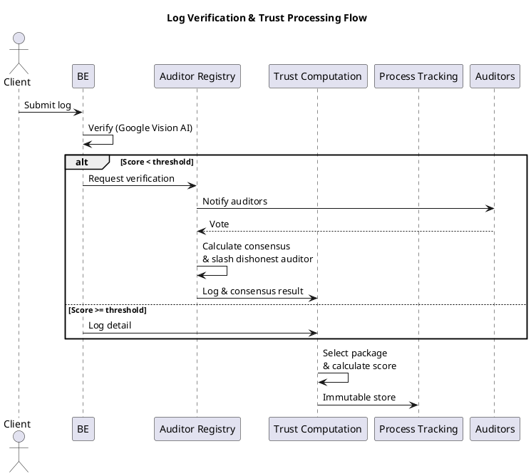
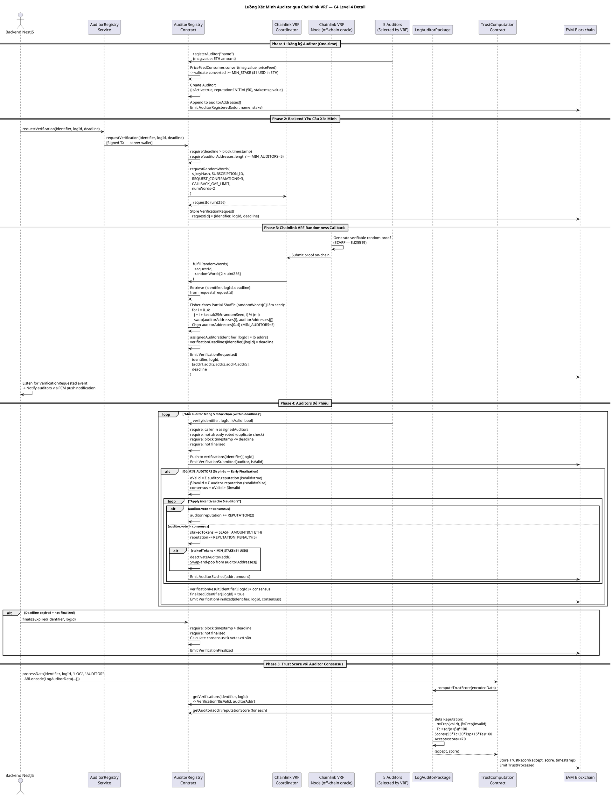
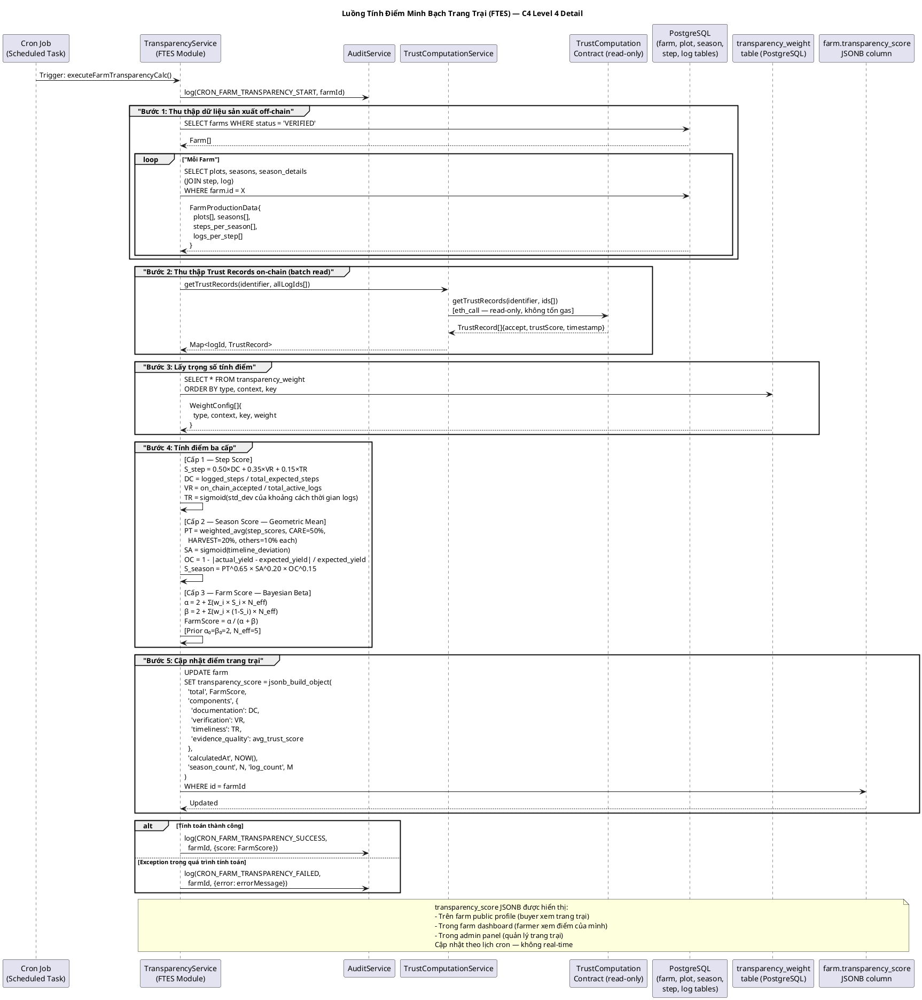

## 4.3 Chi tiết thiết kế hệ thống
### 4.3.1 Quản lý quy trình canh tác theo tiêu chuẩn VietGAP
```plantuml
@startuml
!include https://raw.githubusercontent.com/plantuml-stdlib/C4-PlantUML/master/C4_Component.puml

LAYOUT_WITH_LEGEND()

title Farmera V2 — C4 Level 3: Crop Management Domain

Container_Boundary(crop_domain, "Crop Management Domain (src/modules/crop-management/)") {
    Component(crop_svc, "Crop sub-module", "Controller + Service\ncrop.entity", "Loại cây trồng (SHORT_TERM/LONG_TERM).\nTemplate VietGAP cho từng loại cây.")
    Component(plot_svc, "Plot sub-module", "Controller + Service\nplot.entity", "Thửa đất: vị trí lat/lng (JSONB),\ndiện tích, transparency_score.")
    Component(season_svc, "Season sub-module", "Controller + Service\nseason.entity, season_detail.entity", "Vụ mùa: ngày, yield, status,\ntransparency_score.\nSeasonDetail link Season với Step instances.")
    Component(step_svc, "Step sub-module", "Controller + Service\nstep.entity", "Bước sản xuất bắt buộc áp dụng theo tiêu chuẩn VietGap.")
    Component(log_svc, "Log sub-module", "Controller + Service\nlog.entity", "Nhật ký hoạt động hàng ngày.\nImages/videos, GPS location, timestamp.\ntransaction_hash (on-chain reference).\nonchain_status (PENDING/VERIFIED/REJECTED).")
    Component(img_verify, "ImageVerificationService", "[MODIFIED]\nGoogle Cloud Vision +\nPerceptual Hash", "Gatekeeper chống gian lận")
    Component(verification_svc, "Verification sub-module", "Controller + Service\nverification_assignment.entity", "Quản lý phân công kiểm định viên.\nHandleRequestEvents: PostgreSQL ← blockchain events.\nHandleFinalizedEvents: cập nhật log status.")
    Component(auditor_profile_svc, "AuditorProfile sub-module", "Controller + Service\nauditor_profile.entity", "Hồ sơ kiểm định viên off-chain:\nwallet address, verification counts,\nliên kết User → AuditorProfile.")
}

ContainerDb(postgres, "PostgreSQL", "TypeORM", "log, image_hash, season_detail,\nverification_assignment entities")
System_Ext(gcloud_ext, "Google Cloud Vision API", "HTTPS")
Container_Ext(blockchain_contracts, "Smart Contract Layer\n(ProcessTracking, AuditorRegistry)", "Web3 RPC", "")

Rel(log_svc, img_verify, "verifyImages() trước khi chấp nhận log", "")
Rel(img_verify, gcloud_ext, "annotateImage() — 3 features song song", "HTTPS")
Rel(img_verify, postgres, "SELECT pHash — Hamming distance query", "SQL bitwise")
Rel(log_svc, blockchain_contracts, "addLog(seasonStepId, logId, hashedData)", "Web3 Signed TX")
Rel(step_svc, blockchain_contracts, "addStep() khi bước hoàn thành", "Web3 Signed TX")
Rel(verification_svc, blockchain_contracts, "Poll events: VerificationRequested\nVerificationFinalized", "Web3 eth_getLogs")
Rel(crop_domain, postgres, "TypeORM CRUD — log, season, step, plot", "")
@enduml
```

#### 4.3.1.1 Ánh xạ VietGAP vào cấu trúc dữ liệu

Tiêu chuẩn VietGAP của Bộ Nông nghiệp và Phát triển Nông thôn quy định quy trình sản xuất nông nghiệp an toàn qua năm giai đoạn bắt buộc, tương ứng với vòng đời cây trồng: chuẩn bị đất và vật tư (PREPARE), trồng cây (PLANTING), chăm sóc (CARE), thu hoạch (HARVEST), và xử lý sau thu hoạch (POST_HARVEST). Farmera mã hóa chính xác cấu trúc này vào hệ thống cơ sở dữ liệu, đảm bảo rằng mọi trang trại đều ghi chép đúng trình tự và đủ bước trước khi được cấp điểm minh bạch.
Thiết kế hệ phân cấp Crop → Step → Plot → Season → SeasonDetail → Log phân tách rõ ràng hai lớp: lớp template (Crop, Step) định nghĩa quy trình chuẩn cho từng loại cây, và lớp instance (Season, SeasonDetail, Log) ghi lại thực tế canh tác của từng trang trại. Lớp template do admin hệ thống xây dựng dựa trên tiêu chuẩn VietGAP; lớp instance do nông dân tạo ra trong quá trình sản xuất thực tế. Sự phân tách này cho phép hệ thống áp dụng đúng quy trình VietGAP mà không cứng nhắc - mỗi loại cây có thể có số bước và thứ tự khác nhau.
Kiểm soát tiến trình và tính toàn vẹn quy trình

> 📸 **[Ảnh demo: Màn hình quản lý mùa vụ trên ứng dụng Flutter — hiển thị chuỗi bước PREPARE → PLANTING → CARE với trạng thái DONE/IN_PROGRESS/PENDING]**

- Kiểm soát tiến trình và tính toàn vẹn quy trình

> **[pseudocode]**

Phương thức validateAddSeasonStep() trong StepService thực hiện năm quy tắc kiểm tra trước khi cho phép nông dân thêm một bước mới vào mùa vụ. Quy tắc đầu tiên đảm bảo loại cây trồng khớp: bước VietGAP phải thuộc đúng template cây đang canh tác. Quy tắc thứ hai kiểm tra thứ tự: bước mới phải có order lớn hơn bước hiện tại và không cách quá một nhóm thập phân (tức là không thể nhảy từ PREPARE sang HARVEST bỏ qua PLANTING và CARE). Quy tắc thứ ba là điều kiện tiên quyết quan trọng nhất: bước trước phải có trạng thái DONE trước khi bước tiếp theo có thể bắt đầu — đây là cơ chế enforce tuần tự VietGAP về mặt kỹ thuật. Quy tắc thứ tư kiểm tra bước đầu tiên: bước khởi đầu phải là bước có order nhỏ nhất và is_optional = false trong template. Quy tắc thứ năm xử lý repeated steps: một số bước có thể lặp lại (ví dụ: bón phân nhiều lần trong giai đoạn CARE), bỏ qua kiểm tra thứ tự cho các bước này.

> 📸 **[Ảnh demo: Màn hình thêm nhật ký (log) cho một bước — hiển thị form chụp ảnh, ghi vị trí GPS, và mô tả công việc]**

---

### 4.3.1.2 Pipeline xác minh nhật ký hai lớp

Hệ thống xác minh nhật ký giải quyết vấn đề trọng tâm trong truy xuất nguồn gốc nông sản: làm thế nào để kiểm tra rằng ảnh và video mà nông dân nộp lên thực sự được chụp tại trang trại vào đúng thời điểm, không phải ảnh tải từ internet hay ảnh tái sử dụng từ lần trước?



- Xác minh AI tự động

Lớp thứ nhất chạy hoàn toàn tự động trong ImageVerificationService ngay sau khi nhật ký được tạo, thông qua sự kiện LogAddedEvent. Quá trình gồm hai giai đoạn song song.
Phát hiện trùng lặp bằng Perceptual Hash (pHash). Mỗi ảnh được resize về kích thước 8×8 pixel grayscalem bước này loại bỏ mọi chi tiết nhỏ, chỉ giữ lại "nội dung cốt lõi" của ảnh. Từ 64 pixel thu được, hệ thống tính giá trị trung bình, sau đó tạo hash 64-bit bằng cách so sánh từng pixel với trung bình: pixel sáng hơn → bit 1, tối hơn → bit 0. Hash này đại diện cho "dấu vân tay" của ảnh. Khi kiểm tra, hệ thống so sánh hash mới với tất cả hash đã lưu từ các trang trại khác bằng Hamming distance (đếm số bit khác nhau), nếu khoảng cách ≤ 10/64 bit, ảnh được đánh dấu là có khả năng trùng lặp. PostgreSQL hỗ trợ trực tiếp phép toán XOR trên kiểu bit(64) và hàm bit_count(), cho phép thực hiện toàn bộ phép tính trong SQL mà không cần load dữ liệu lên ứng dụng.

Phân tích nội dung bằng Google Cloud Vision API. Ba tính năng API được gọi song song: Label Detection (phân loại nội dung — kiểm tra ảnh có liên quan đến nông nghiệp không qua bộ nhãn AGRICULTURAL_LABELS), Web Detection (phát hiện ảnh đã tồn tại trên internet), và Safe Search (lọc nội dung không phù hợp). Kết quả được tổng hợp thành điểm trung bình tổng thể.
Định tuyến dựa trên rủi ro. Sau khi có điểm AI, hệ thống phân loại nhật ký theo ba mức: nhật ký có điểm dưới 0.6 (rủi ro cao - ảnh không liên quan hoặc có dấu hiệu gian lận) được chuyển bắt buộc đến kiểm định viên; nhật ký trong khoảng 0.6 - 0.8 (rủi ro trung bình) được lấy mẫu xác suất 20% để giảm tải cho kiểm định viên trong khi vẫn duy trì độ kiểm soát; nhật ký trên 0.8 (rủi ro thấp) được tự động duyệt. Thiết kế định tuyến theo rủi ro này là ứng dụng lý thuyết trò chơi trong lấy mẫu: nông dân không biết nhật ký nào của họ sẽ bị kiểm tra kỹ - ngay cả nhật ký "sạch" vẫn có 20% khả năng được kiểm định viên xem xét, tạo incentive duy trì chất lượng liên tục.

- Xác minh kiểm định viên phi tập trung

Khi một nhật ký cần kiểm định viên xem xét, hệ thống thực hiện hai bước chuẩn bị quan trọng trước khi chuyển lên blockchain. Đầu tiên, ProcessTrackingService.addTempLog() ghi hash SHA-256 của nhật ký vào smart contract như một "checkpoint bất biến" - hash này được tạo tại thời điểm nhật ký vừa được nộp, đảm bảo rằng nội dung không thể bị thay đổi trong suốt thời gian chờ kiểm định viên (có thể kéo dài đến 7 ngày). Thứ hai AuditorRegistryService.requestVerification() gửi giao dịch đến smart contract AuditorRegistry để kích hoạt quy trình chọn kiểm định viên ngẫu nhiên qua Chainlink VRF. Cron job chạy mỗi phút trong VerificationService thực hiện hai nhiệm vụ: handleRequestEvents() đọc sự kiện VerificationRequested từ blockchain và tạo các VerificationAssignment record  - liên kết giữa kiểm định viên được chọn on-chain và bản ghi off-chain trong hệ thống; handleFinalizedEvents() đọc sự kiện VerificationFinalized và cập nhật trạng thái nhật ký tương ứng.
Kiểm định viên được phân công nhận được nội dung nhật ký đầy đủ, hash on-chain (để tự kiểm tra tính toàn vẹn bằng cách so sánh với nội dung hiện tại), và kết quả phân tích AI làm tài liệu tham khảo. Kiểm định viên submit phiếu bầu trực tiếp lên smart contract thông qua ví blockchain của họ - đây là bước duy nhất trong toàn bộ quy trình yêu cầu kiểm định viên tự ký giao dịch, đảm bảo tính phi tập trung và không thể chối cãi của phiếu bầu.

### 4.3.2 ProcessTracking — Lưu trữ bất biến trên blockchain

ProcessTracking.sol là hợp đồng đơn giản nhất trong hệ thống nhưng đảm nhiệm vai trò nền tảng nhất: biến dữ liệu off-chain thành bằng chứng không thể xóa. Kiến trúc lưu trữ gồm ba lớp mapping lồng nhau: s_season[seasonId] → stepIds[], s_seasonStepLogs[stepId] → logIds[], và s_logs[logId] → hashedData. Hierarchy này ánh xạ chính xác cấu trúc dữ liệu off-chain (Season → Step → Log) lên on-chain, cho phép truy xuất toàn bộ lịch sử của một mùa vụ chỉ với một seasonId.

Cơ chế write-once được thực thi bằng kiểm tra đơn giản nhưng hiệu quả: trước khi ghi, hàm addLog() kiểm tra xem s_logs[logId] có phải chuỗi rỗng không. Nếu đã có giá trị, transaction revert với lỗi ProcessTracking__InvalidLogId. Vì smart contract là bất biến trên blockchain và không có hàm upgrade hay delete, đây là đảm bảo tuyệt đối: một khi hash của nhật ký được ghi, không ai - kể cả nhà vận hành hệ thống - có thể xóa hay thay thế nó.

Commitment Hash Pattern là thiết kế cốt lõi giúp cân bằng giữa tính bất biến và chi phí gas. Thay vì lưu toàn bộ nội dung nhật ký (ảnh, mô tả, GPS) lên blockchain một cách tốn kém, hệ thống chỉ ghi "dấu vân tay" SHA-256 của nhật ký. Hàm hash được tính từ HashedLog DTO gồm tất cả trường nhạy cảm: id, tên, mô tả, danh sách URL ảnh và video, tọa độ GPS, thời gian tạo, và farm_id. Bất kỳ thay đổi nào trong dữ liệu off-chain cũng sẽ tạo ra hash khác, làm mất sự khớp với hash đã ghi on-chain.


```plantuml
@startuml C4_ProcessTracking_Component
!include https://raw.githubusercontent.com/plantuml-stdlib/C4-PlantUML/master/C4_Component.puml

LAYOUT_WITH_LEGEND()

title Farmera V2 — ProcessTracking Smart Contract (C4 Level 3 Component View)

Container_Boundary(process_group, "Process Tracking Group") {
    Component(process_tracking_c, "ProcessTracking.sol", "No access control\nWrite-once, append-only", "Lưu trữ bất biến nhật ký sản xuất.\n\nmapping(logId => string hashedData)\nmapping(seasonStepId => uint64[] logIds)\nmapping(seasonId => uint64[] seasonStepIds)\n\nHàm ghi:\n  addLog(seasonStepId, logId, hashedData)\n  addStep(seasonId, seasonStepId, hashedData)\n  addTempLog(logId, hashedData)  ← checkpoint\n\nHàm đọc:\n  getLog(logId), getLogs(stepId),\n  getSteps(seasonId), getTempLog(logId)\n\nEvents:\n  LogAdded(logId, hashedData)\n  TempLogAdded(logId, hashedData)\n  StepAdded(seasonId, seasonStepId)")
}

Component(pt_svc, "ProcessTrackingService", "NestJS Service\nWeb3.js v4.16\nProcessTracking ABI", "Oracle Bridge:\nKý giao dịch bằng WALLET_PRIVATE_KEY\nABI-encode/decode contract calls\nLưu txHash vào PostgreSQL")

Container_Ext(backend, "NestJS API Server", "", "")
System_Ext(evm, "EVM Blockchain", "", "Immutable state storage\nPublic verifiability")

Rel(backend, pt_svc, "addLog() / addStep() / addTempLog()\n→ sau khi xác minh ảnh pass", "")
Rel(pt_svc, process_tracking_c, "Signed TX via server wallet\n(WALLET_PRIVATE_KEY)", "Web3 RPC — JSON-RPC")
Rel(process_tracking_c, evm, "State changes: s_logs[], s_temp_logs[]\nEvent emission", "EVM execution")

@enduml
```

Một quyết định thiết kế quan trọng trong Farmera là không yêu cầu nông dân có ví blockchain. Tất cả giao dịch ghi lên blockchain đều được ký bởi server wallet, backend đóng vai trò "oracle bridge" giữa thế giới off-chain và on-chain. Nông dân chỉ cần tương tác với API REST thông thường.
Thiết kế này có đánh đổi rõ ràng: server trở thành điểm tin cậy trung gian. Tuy nhiên, tính bất biến của blockchain vẫn được bảo toàn vì hash được tính từ dữ liệu thực tế của nông dân (ảnh họ chụp, tọa độ GPS thiết bị họ cầm) - server chỉ là người ký, không thể tạo hash "giả" mà vẫn khớp với dữ liệu thật. Nếu server gian lận (ghi hash không khớp với nội dung), bất kỳ ai cũng có thể phát hiện bằng cách tái tính hash từ dữ liệu off-chain và so sánh với on-chain.

### 4.3.3 Hệ thống quản lý kiểm định viên (AuditorRegistry)



#### 4.3.3.1 Cơ chế Stake kinh tế và Chainlink Price Feed

`AuditorRegistry.sol` là hợp đồng phức tạp kết hợp ba yếu tố: quản lý danh tính kiểm định viên, cơ chế kinh tế stake/slash, và tích hợp oracle ngẫu nhiên. Kiểm định viên đăng ký bằng cách gọi `registerAuditor()` kèm ETH stake tối thiểu tương đương 1 USD. Giá ETH/USD được lấy real-time từ Chainlink Price Feed qua hợp đồng AggregatorV3Interface - không dùng giá cố định mà dùng giá oracle cập nhật liên tục. Đây là tích hợp thực tế của Chainlink Data Feeds, đảm bảo rào cản gia nhập ($1 USD) là nhất quán bất kể biến động giá ETH.
Mỗi kiểm định viên khởi đầu với reputationScore = 50 (thang 0–100, trung lập). Reputation là tài sản vô hình tích lũy qua thời gian: vote đúng theo đồng thuận cộng 2 điểm, vote sai trừ 5 điểm và slash 0.1 ETH stake. Cấu trúc penalty bất đối xứng (mất 5 điểm vs được 2 điểm) là thiết kế có chủ ý - ảnh hưởng của một lần vote sai cần nhiều lần vote đúng để bù đắp, tạo incentive mạnh cho tính cẩn thận. Nếu stake giảm xuống dưới ngưỡng tối thiểu sau các lần slash, kiểm định viên bị vô hiệu hóa.

#### 4.3.3.2 Chọn kiểm định viên ngẫu nhiên bằng Chainlink VRF 2.5

Việc chọn kiểm định viên ngẫu nhiên cho mỗi nhật ký cần xác minh là yêu cầu bảo mật quan trọng: nếu nông dân gian lận có thể dự đoán hoặc ảnh hưởng đến việc ai sẽ xem xét nhật ký của họ, họ có thể cấu kết với những kiểm định viên đó. **Chainlink VRF (Verifiable Random Function) 2.5** giải quyết bài toán này bằng cách cung cấp nguồn entropy ngẫu nhiên có thể xác minh mật mã học — không thể dự đoán trước và không thể giả mạo.

Luồng xử lý: `requestVerification()` gọi `s_vrfCoordinator.requestRandomWords()`. Chainlink VRF node tạo cặp (randomness, proof) và gọi callback `fulfillRandomWords()` trên contract. Trong callback, randomWords[0] được dùng làm seed cho Fisher-Yates Partial Shuffle (thuật toán xáo trộn một phần đầu mảng để lấy k phần tử ngẫu nhiên mà không cần shuffle toàn bộ) để xáo trộn và chọn ra các kiểm định viên ngẫu nhiên.

Kết quả là kiểm định viên được chọn ngẫu nhiên, không thể dự đoán và có thể xác minh bởi bất kỳ ai bằng cách replay lại quá trình shuffle với cùng randomSeed đã ghi on-chain. Sự kiện `VerificationRequested` emit danh sách các địa chỉ được chọn - cron job của backend nhận event này và tạo `VerificationAssignment`.

#### 4.3.3.3 Vòng đời xác minh và cơ chế Finalization

Mỗi nhật ký cần kiểm định có deadline 7 ngày (`VERIFICATION_DEADLINE_DAYS`). Trong khoảng thời gian này, 5 kiểm định viên được phân công có thể submit phiếu bầu qua `verify(identifier, id, isValid)`. Để ngăn chặn double voting, contract kiểm tra `assignedAuditors[identifier][id][msg.sender]` trước khi chấp nhận phiếu.

Finalization có thể xảy ra theo hai cách: **early finalization** khi đủ phiếu (tất cả auditor đã vote trước deadline), hoặc **expired finalization** khi `finalizeExpired()` được gọi sau deadline (ai cũng có thể gọi hàm này — không cần quyền đặc biệt). Cả hai đều kích hoạt cùng logic `finalizeVerification()`: tính consensus (validVotes > invalidVotes), áp dụng reward/slash, lưu kết quả vào `verificationResult[identifier][id]`, emit `VerificationFinalized` event.

### 4.3.4 Thiết kế TrustWorthiness Smart Contract

#### Sơ đồ thành phần (C4 Level 3)

Hệ thống TrustWorthiness gồm bốn contract liên kết theo Strategy Pattern: `TrustComputation` (orchestrator), `MetricSelection` (registry), và hai concrete strategy `LogDefaultPackage` / `LogAuditorPackage`. Thiết kế này tách biệt logic định tuyến khỏi logic tính điểm, cho phép thêm thuật toán mới mà không cần redeploy contract core.

```plantuml
@startuml C4_TrustComputation_Components
!include https://raw.githubusercontent.com/plantuml-stdlib/C4-PlantUML/master/C4_Component.puml

LAYOUT_WITH_LEGEND()

title Farmera V2 — Trust Computation Group (C4 Level 3 Component View)

Container_Boundary(trust_group, "Trust Computation Group — Strategy Pattern on Blockchain") {
    Component(trust_computation_c, "TrustComputation.sol", "Orchestrator\nWrite-once trust records\nDuplicate prevention", "Điều phối tính điểm tin cậy.\nmapping(bytes32 × uint64) → TrustRecord{\n  accept: bool,\n  trustScore: uint128,\n  timestamp: uint64\n}\nprocessData(identifier, id, dataType, context,\n  encodedData):\n  1. Kiểm tra duplicate: revert nếu đã xử lý\n  2. getTrustPackage(dataType, context)\n  3. Delegate computeTrustScore()\n  4. Store immutably\nEvent: TrustProcessed(identifier, id, accept, score)")

    Component(metric_selection_c, "MetricSelection.sol", "Registry Pattern\nOn-chain package directory", "Registry cho trust algorithm packages.\nmapping(keccak256(dataType+context) => address)\nregisterTrustPackage(dataType, context, addr):\n  → No duplicates allowed\ngetTrustPackage(dataType, context):\n  → address(0) if not found\nEvent: TrustPackageRegistered(key)\n\nEntries hiện tại:\n  ('log', 'system')  → LogDefaultPackage\n  ('log', 'auditor') → LogAuditorPackage")

    Component(trust_pkg_interface, "ITrustPackage.sol", "Solidity Interface\nPure contract standard", "Standard interface cho mọi package:\ncomputeTrustScore(bytes calldata payload)\n  -> (bool accept, uint128 score)\nPure function: không đọc/ghi state.\nABI-encoded payload input.\nGas-efficient: delegate không cần state access.")

    Component(log_default_c, "LogDefaultPackage.sol", "Pure computation\nKhông có external calls\nContext: 'system' (auto-verify)", "Thuật toán mặc định — không cần auditor.\nInput: LogData{imageCount, videoCount,\n  logLocation{lat,lng}, plotLocation{lat,lng}}\n\nWeights: Tsp=60%, Tec=40%\nAccept threshold: score >= 60\n\nTsp (Spatial Plausibility):\n  dist² = (lat1-lat2)² + (lng1-lng2)²\n  dist² <= 100,000² → Tsp=100; else Tsp=0\n  [Binary — không dùng sqrt() để tiết kiệm gas]\n\nTec (Evidence Completeness):\n  Tec = min((imageCount+videoCount)/2, 1)*100\n\nScore = (60*Tsp + 40*Tec) / 100")

    Component(log_auditor_c, "LogAuditorPackage.sol", "Cross-contract read\nfrom AuditorRegistry\nContext: 'auditor'", "Thuật toán với đồng thuận auditor.\nInput: LogAuditorData{identifier, id,\n  imageCount, videoCount, locations}\n\nWeights: Tc=55%, Tsp=30%, Te=15%\nAccept threshold: score >= 70\n\nTc (Consensus — Beta Reputation):\n  α = Σ reputationScore (isValid=true)\n  β = Σ reputationScore (isValid=false)\n  Tc = α/(α+β) × 100\n  [Jøsang & Ismail, 2002]\n\nScore = (55*Tc + 30*Tsp + 15*Te) / 100")
}

Container_Ext(backend, "NestJS TrustComputationService", "", "")
Container_Ext(auditor_registry_c, "AuditorRegistry.sol", "", "getVerifications()\ngetAuditor().reputationScore")

Rel(backend, trust_computation_c, "processData(identifier, id, dataType,\n  context, ABI.encode(LogData))", "Web3 Signed TX")
Rel(trust_computation_c, metric_selection_c, "getTrustPackage(dataType, context)\n→ package address", "EVM Internal Call")
Rel(trust_computation_c, log_default_c, "computeTrustScore(encodedLogData)\n→ (accept, score)", "EVM Internal Call\n(via ITrustPackage)")
Rel(trust_computation_c, log_auditor_c, "computeTrustScore(encodedLogAuditorData)\n→ (accept, score)", "EVM Internal Call\n(via ITrustPackage)")
Rel(log_default_c, trust_pkg_interface, "implements", "")
Rel(log_auditor_c, trust_pkg_interface, "implements", "")
Rel(log_auditor_c, auditor_registry_c, "getVerifications(identifier, id)\ngetAuditor(addr).reputationScore", "EVM Cross-contract Read\n(view — no gas)")

@enduml
```

#### 4.3.4.1 Nền tảng lý thuyết

Leteane và Ayalew (2024)[1] chỉ ra rằng blockchain đơn thuần không đủ để giải quyết vấn đề tin cậy trong truy xuất nguồn gốc thực phẩm. Dữ liệu được ghi lên blockchain là bất biến, nhưng điều đó không đảm bảo dữ liệu đó đúng ngay từ đầu. Một nông dân có thể ghi hash của một ảnh cây trồng sai, hoặc khai báo sai địa điểm canh tác - blockchain sẽ lưu trữ bằng chứng gian lận một cách hoàn hảo. Giải pháp của họ là tích hợp mô hình trust vào hệ thống blockchain để định lượng mức độ tin cậy của từng thực thể đóng góp dữ liệu, dựa trên lịch sử hành vi của họ.

Farmera hiện thực hóa cách tiếp cận này qua hệ thống smart contract TrustWorthiness. Mỗi nhật ký canh tác sau khi được ghi hash (bất biến) sẽ được đánh giá tin cậy (trust) bởi một thuật toán, kết quả cũng được lưu on-chain thành TrustRecord. Điểm tin cậy này có hai ý nghĩa: nó phản ánh chất lượng của nhật ký cụ thể đó, và nó ảnh hưởng đến điểm tổng hợp FTES của trang trại hiển thị công khai với người mua.

#### 4.3.4.2 Kiến trúc Pluggable Trust Package
Thách thức trong việc thiết kế hệ thống tính điểm tin cậy trên blockchain là các thuật toán có thể cần cập nhật khi hệ thống phát triển trong khi smart contract là bất biến sau khi deploy. Farmera giải quyết mâu thuẫn này bằng kiến trúc Strategy Pattern trên blockchain: tách biệt hoàn toàn phần "orchestrator" (không thay đổi) và phần "thuật toán" (có thể thay thế).
TrustComputation.sol đóng vai trò orchestrator: nó nhận dữ liệu, tra cứu package địa chỉ từ MetricSelection.sol, và gọi computeTrustScore() trên package đó. MetricSelection.sol là registry on-chain: mapping keccak256(dataType + context) → address. Mỗi cặp (dataType, context) chỉ đến một contract package cụ thể. 

Ví dụ ("log", "system") → LogDefaultPackage, ("log", "auditor") → LogAuditorPackage. Khi cần thêm thuật toán mới, developer chỉ cần deploy contract mới và gọi registerTrustPackage(), hai contract core không bao giờ cần redeploy.

#### 4.3.4.3 Cơ chế tính TrustScore

Farmera cài đặt 2 package mặc định phục vụ cho việc tính trust score cho mỗi nhật kí được đưa lên blockchain từ pipeline xác minh nhất kí 2 lớp đã trình bày trước đó là LogDefaultPackage – trường hợp nhật kí vướt qua kiếm duyệt AI, LogAuditorPakcage – trường hợp nhật kí không qua kiểm duyệt AI và cần được đánh giá bởi kiểm định viên.

- Định nghĩa Trust Score

**Trust Score** là giá trị số lượng hóa đại diện cho mức độ tin cậy (trustworthiness) của một nhật ký canh tác (Log) trong hệ thống. Mỗi Log là lời khai của nông dân về một hoạt động sản xuất cụ thể, và Trust Score định lượng mức độ hệ thống tin vào lời khai đó. Jøsang, Ismail & Boyd (2007) [3] định nghĩa trustworthiness trong hệ thống phân tán là mức độ một agent có thể tin tưởng rằng thực thể kia sẽ hành động theo cam kết đã tuyên bố — trong bối cảnh Farmera, "cam kết" chính là nội dung nhật ký (ảnh, GPS, mô tả hoạt động) được khai báo là trung thực.

Hệ thống có hai loại điểm số riêng biệt, không được nhầm lẫn:

| Điểm số | Đối tượng | Câu hỏi đánh giá | Nơi tính |
|---------|-----------|-----------------|----------|
| **Trust Score** | Nhật ký (Log) | Lời khai của nông dân về một hoạt động có đáng tin không? | **On-chain** — smart contract, bất biến và công khai |
| **Farm Score (Transparency Score)** | Trang trại (Farm) | Trang trại này minh bạch và đáng tin cậy ở mức độ nào? | **Off-chain** — backend, tổng hợp từ tất cả Trust Score kết hợp chỉ số canh tác |

- Trust Score của nhật ký - Nền tảng MCDA và Weighted Sum Model - Bài toán tổng hợp đa tiêu chí

Việc tính Trust Score cho một Log là bài toán tổng hợp nhiều tiêu chí độc lập thành một con số duy nhất đại diện cho "mức độ đáng tin" của Log đó. Đây là bài toán thuộc lĩnh vực Multiple-Criteria Decision Analysis (MCDA) - một nhánh của nghiên cứu vận hành dùng để đánh giá các giải pháp dựa trên nhiều tiêu chí khi các tiêu chí có thể mâu thuẫn hoặc có mức độ quan trọng khác nhau.

Các tiêu chí được chọn là: đồng thuận kiểm định viên (Tc), độ chính xác vị trí GPS (Tsp), và mức độ đầy đủ bằng chứng (Te). Ba tiêu chí này độc lập nhau về nguồn gốc dữ liệu và ý nghĩa ngữ nghĩa - đây là điều kiện tiên quyết để áp dụng MCDA.

Weighted Sum Model (WSM) - còn gọi là weighted linear combination - là phương pháp MCDA đơn giản và phổ biến nhất, trong đó mỗi tiêu chí được gán trọng số tương ứng với tầm quan trọng của nó, và tổng có trọng số chính là điểm số cuối cùng. 
Ngoài ra, một số phương pháp MCDA khác cũng được xem xét và bị loại trừ như:

Weighted product: Zero collapse nếu có bất kì tiêu chí nào bằng 0

Topsis: Xếp hạng giữa các phương án với nhau - không cho ra điểm tuyệt đối. Score của log A phụ thuộc vào log B, C, D cùng batch, do đó, ranking method, không phải scoring method. Không phù hợp cho phương pháp tính điểm tuyệt đối độc lập cho từng log.

Electre: Cho ra đồ thị outranking, không cho ra một điểm số duy nhất. Không phù hợp cho phương pháp tính điểm log.

Tóm lại, Weighted Sum Model  là lựa chọn thích hợp nhất do phương pháp này cho ra điểm tuyệt đối, tính độc lập từng log, minh bạch, dễ giải thích, tính được on-chain với gas cost thấp 

Công thức được áp dụng:

$$S_{log} = w_1 \times T_c + w_2 \times T_{sp} + w_3 \times T_e \quad (\Sigma w_i = 1) \quad \text{[Log qua kiểm định viên]}$$

$$S_{log} = w_1 \times T_{sp} + w_2 \times T_e \quad (\Sigma w_i = 1) \quad \text{[Log tự động duyệt — không có } T_c\text{]}$$

- Các tiêu chí đánh giá và nền tảng lý thuyết

Ba tiêu chí được chọn dựa trên khung lý thuyết **Data Quality Dimensions** của Wang & Strong (1996) [4] — công trình nền tảng định nghĩa các chiều chất lượng dữ liệu từ góc nhìn người dùng, được trích dẫn hơn 6,000 lần trong cộng đồng học thuật. Mỗi tiêu chí ánh xạ trực tiếp vào một chiều chất lượng dữ liệu có nền tảng lý thuyết rõ ràng:

| Tiêu chí | Ký hiệu | Chiều DQ (Wang & Strong, 1996) [4] | Câu hỏi |
|----------|---------|--------------------------------------|---------|
| Đồng thuận kiểm định viên | $T_c$ | **Believability** — mức độ thông tin được coi là đúng và đáng tin | Các kiểm định viên uy tín có tin nhật ký này không? |
| Độ chính xác không gian | $T_{sp}$ | **Accuracy** — mức độ dữ liệu phản ánh chính xác thực tế | Nông dân có đang ở đúng mảnh đất đã đăng ký không? |
| Độ hoàn chỉnh bằng chứng | $T_e$ | **Completeness** — mức độ dữ liệu đủ và không thiếu | Nhật ký có đủ bằng chứng hình ảnh không? |

Ba tiêu chí này độc lập nhau về nguồn gốc dữ liệu và ý nghĩa ngữ nghĩa — đây là điều kiện tiên quyết để áp dụng WSM mà không bị double-counting.

**Tiêu chí $T_c$ — Đồng thuận kiểm định viên (Consensus Score)**

$T_c$ đo mức độ đồng thuận của mạng lưới kiểm định viên có uy tín về tính hợp lệ của một Log, áp dụng cho Log cần qua lớp kiểm định viên (score AI < 0.8):

$$\alpha = \sum_{i \in \text{valid}} \text{reputationScore}_i, \qquad \beta = \sum_{i \in \text{invalid}} \text{reputationScore}_i, \qquad T_c = \frac{\alpha}{\alpha + \beta} \times 100$$

Công thức dựa trên **Beta Reputation System** của Jøsang & Ismail (2002) [3]: mỗi kiểm định viên chỉ có hai lựa chọn nhị phân — đây là bài toán ước lượng xác suất từ dữ liệu nhị phân, giải pháp Bayesian chuẩn là phân phối Beta với α và β là tổng "bằng chứng" ủng hộ và phản đối. Jøsang & Ismail (2002) chứng minh rằng khi feedback đến từ các agent có độ uy tín khác nhau, mỗi agent nên đóng góp lượng bằng chứng tỷ lệ với reputation — do đó dùng `reputationScore` làm trọng số thay vì đếm số phiếu là nhất quán về mặt lý thuyết. Thiết kế này cũng ngăn cấu kết của nhiều auditor mới (reputation thấp) vì trọng số thấp của họ không thể lấn át các auditor có track record lâu dài.

**Tiêu chí $T_e$ — Độ hoàn chỉnh bằng chứng (Evidence Completeness)**

$T_e$ đo mức độ đầy đủ của bằng chứng trực quan (ảnh + video) kèm theo Log:

$$T_e = \min\!\left(\frac{\text{imageCount} + \text{videoCount}}{\text{MAX\_IMAGE} + \text{MAX\_VIDEO}}, \; 1\right) \times 100$$

Đây là dạng tổng quát $\min(x / x_{max}, 1)$ được Pipino, Lee & Wang (2002) [5] đề xuất như metric chuẩn cho chiều **Completeness** trong đánh giá chất lượng dữ liệu: đo tỷ lệ giữa giá trị thực tế so với giá trị tối đa kỳ vọng, giới hạn tại 1 để tránh phần thưởng cho dư thừa (nộp 10 ảnh không được điểm cao hơn nộp 2 ảnh đủ tiêu chuẩn).

**Tiêu chí $T_{sp}$ — Độ chính xác không gian (Spatial Plausibility)**

$T_{sp}$ kiểm tra xem vị trí GPS ghi nhận khi tạo Log có nằm trong phạm vi hợp lý của mảnh đất đã đăng ký không:

$$T_{sp} = \begin{cases} 100 & \text{nếu dist}^2 \leq \text{MAX\_DISTANCE}^2 \\ 0 & \text{nếu dist}^2 > \text{MAX\_DISTANCE}^2 \end{cases} \quad \text{với} \quad \text{dist}^2 = (\text{lat}_{log} - \text{lat}_{plot})^2 + (\text{lng}_{log} - \text{lng}_{plot})^2$$

Squared Euclidean được dùng thay vì Haversine vì Haversine cần hàm lượng giác (sin, cos, arcsin) không tồn tại trong Solidity. Với khoảng cách dưới vài chục kilômét, mặt đất xấp xỉ phẳng và sai số Euclidean là không đáng kể so với GPS accuracy của thiết bị di động (~5–15m). $T_{sp}$ là kiểm tra nhị phân vì câu hỏi "nông dân có đang ở thửa đất đã đăng ký không?" có ý nghĩa nhị phân trong ngữ cảnh chống gian lận — nếu GPS nằm ngoài phạm vi 100m, đó là dấu hiệu rõ ràng Log không được tạo tại đồng ruộng, bất kể khoảng cách chính xác là bao nhiêu.

### 4.3.5 Cơ chế tính điểm minh bạch FTES

#### Sơ đồ luồng tính điểm (C4 Level 4)

Sơ đồ dưới đây mô tả cách `TransparencyService` tổng hợp dữ liệu từ cả PostgreSQL (off-chain) và TrustComputation contract (on-chain) để tính điểm minh bạch tổng hợp theo cơ chế cron định kỳ.



Trang trại trong Farmera đóng hai vai trò song song: nhà sản xuất thực phẩm cần minh bạch quy trình canh tác, và nhà cung cấp trên sàn thương mại cần chứng minh độ tin cậy giao hàng. Hai vai trò này yêu cầu hai chiều đánh giá tương ứng, tổng hợp thành Farm Score:

Farm Score = f(Farm Transparency Score, Order Fulfillment Rate, Market Validation)

- Farm Transparency Score - Điểm minh bạch quy trình sản xuất

Farm Transparency Score tổng hợp N Trust Score của các Log thuộc trang trại thành một điểm minh bạch duy nhất. Điểm này trả lời câu hỏi: "Toàn bộ nhật ký canh tác của trang trại này, xét chung lại, có đáng tin không?"

Lựa chọn phương pháp: Geometric Mean (trung bình nhân)

Geometric Mean - trung bình nhân - của N số dương được tính theo công thức:

G = (s₁ × s₂ × ... × sₙ)^(1/N) = exp( (1/N) × Σ ln(sᵢ) )

Để tránh trường hợp ln(0) khi Trust Score bằng 0, công thức áp dụng một hằng số bù nhỏ:

Farm Transparency Score = exp( (1/N) × Σ ln(max(sᵢ, ε)) )

Trong đó:

  sᵢ = Trust Score của log thứ i (on-chain, đã tính bất biến)

  N  = tổng số log của trang trại

  ε  = hằng số bù nhỏ để tránh ln(0)

Lý do chọn Geometric Mean thay vì Arithmetic Mean:

Geometric Mean phù hợp để tổng hợp N điểm số đồng nhất khi mục tiêu là phát hiện bất thường. Tính chất penalization của Geometric Mean đảm bảo một log bất thường không bị pha loãng bởi số đông log tốt - điều mà Arithmetic Mean không làm được:

Ví dụ: 9 logs điểm 1.0, 1 log điểm 0.01

Arithmetic Mean = (9 × 1.0 + 0.01) / 10 = 0.901   ← log xấu bị "nuốt"

Geometric Mean  = (1.0⁹ × 0.01)^(1/10)  = 0.631   ← log xấu kéo điểm xuống rõ rệt

Trong ngữ cảnh thực phẩm sạch, một Log gian lận không thể bị "pha loãng" bởi những Log tốt xung quanh - điều đó sẽ phá vỡ hoàn toàn ý nghĩa của hệ thống xác minh.

- Order Fulfillment Rate (OFR) - Tỷ lệ hoàn thành đơn hàng

OFR là tỷ lệ đơn hàng được thực hiện thành công - giao đúng hàng, đúng thời gian, không bị hủy bởi phía trang trại. Đây là chỉ số hành vi khách quan đo độ tin cậy giao hàng của nhà cung cấp:

OFR = Số đơn hàng hoàn thành thành công / Tổng số đơn hàng đã nhận

Dựa vào nền tảng học thuật Parasuraman et al. (2005)[8] trong thang đo E-S-QUAL xác định Fulfillment là một trong bốn chiều cốt lõi của chất lượng dịch vụ thương mại điện tử, định nghĩa là "mức độ thực hiện đúng cam kết về giao hàng." Deshpande & Pendem (2022)[9] củng cố điều này qua phân tích thực nghiệm trên 15 triệu đơn hàng từ nền tảng Tmall, chứng minh hiệu suất giao hàng ảnh hưởng trực tiếp và đáng kể đến rating của seller và doanh số bán hàng.

- Market Validation (MV) — Điểm đánh giá từ người mua

MV là điểm đánh giá trung bình từ người mua thực tế sau khi nhận sản phẩm, phản ánh nhận thức chất lượng tích lũy từ phía người tiêu dùng:
MV = avg(product_ratings) / 5        [thang 0–1]
Nền tảng học thuật: Chevalier & Mayzlin (2006)[10] chứng minh thực nghiệm rằng điểm đánh giá trực tuyến là tín hiệu có giá trị thống kê phản ánh chất lượng thực sự của sản phẩm và nhà cung cấp, không thể thay thế bằng các chỉ số hành vi như OFR.

---

## Tài liệu tham khảo Chương 4

- Leteane, O., & Ayalew, Y. (2024). *Improving the Trustworthiness of Traceability Data in Food Supply Chain Using Blockchain and Trust Model*. IEEE Access.
- Jøsang, A., & Ismail, R. (2002). *The Beta Reputation System*. Proceedings of the 15th Bled Electronic Commerce Conference. [3]
- Jøsang, A., Ismail, R., & Boyd, C. (2007). *A survey of trust and reputation systems for online service provision*. Computer Networks, 50(3), 337–363. [3]
- Wang, R. Y., & Strong, D. M. (1996). *Beyond Accuracy: What Data Quality Means to Data Consumers*. Journal of Management Information Systems, 12(4), 5–33. [4]
- Pipino, L. L., Lee, Y. W., & Wang, R. Y. (2002). *Data Quality Assessment*. Communications of the ACM, 45(4), 211–218. [5]
- Triantaphyllou, E. (2000). *Multi-Criteria Decision Making Methods: A Comparative Study*. Springer. (MCDA/WSM framework)
- Brown, S. (2018). *The C4 model for visualising software architecture*. leanpub.com/visualising-software-architecture.
- Chainlink Documentation. *Verifiable Random Function (VRF) v2.5*. docs.chain.link/vrf.
- Chainlink Documentation. *Data Feeds — Using Price Feeds*. docs.chain.link/data-feeds.
- Tiêu chuẩn VietGAP — Quyết định số 379/QĐ-BNN-KHCN ngày 28/01/2008, Bộ Nông nghiệp và Phát triển Nông thôn Việt Nam.
- Matter Labs. *zkSync Era Documentation — EVM Compatibility*. era.zksync.io/docs.
- Wood, G. (2014). *Ethereum: A Secure Decentralised Generalised Transaction Ledger (Yellow Paper)*. ethereum.github.io/yellowpaper.
